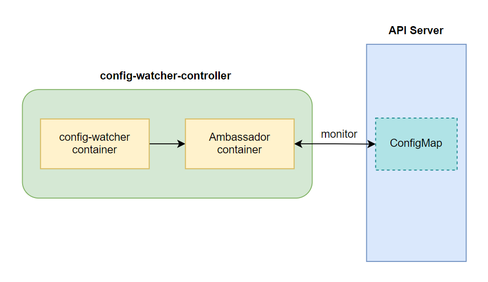
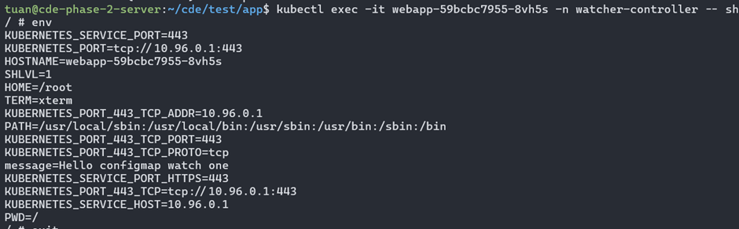
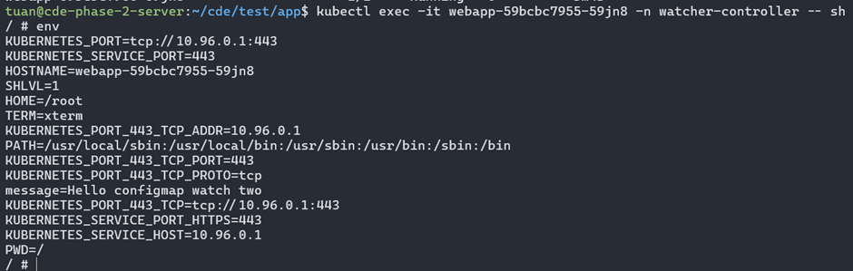
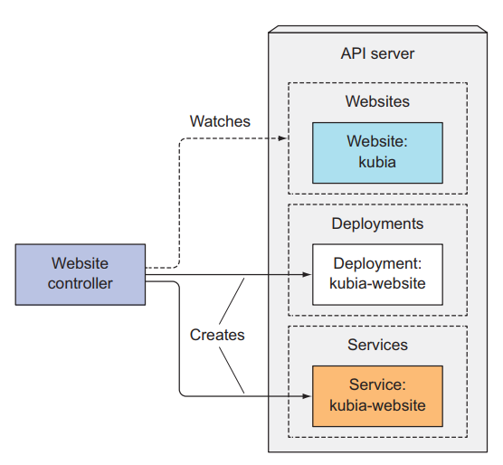
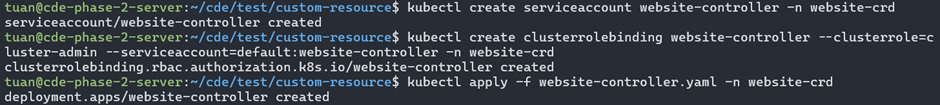
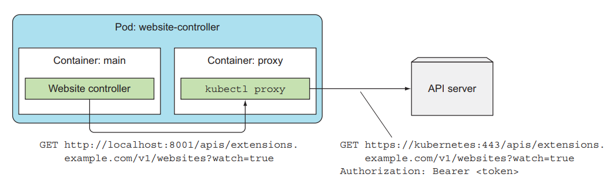
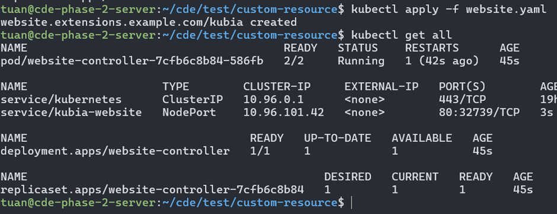

# Adding custom resource to Kubernetes

## 1. Giới thiệu

Bên cạnh những resource mặc định như Pod, ReplicaSet, Deployment, StatefulSet, ... Thì kubernetes cho phép chúng ta tạo thêm những custom resource để đáp ứng đúng nhu cầu của chúng ta trong dự án, từng custom resource sẽ phục vụ cho một mục đích cụ thể nào đó trong dự án của chúng ta. Ví dụ, để tạo postgres database trong kubernetes, thì đầu tiên ta sẽ định nghĩa một StatefulSet, sau đó tạo một Service cho StatefulSet này để client có thể kết nối được tới nó. Ta có thể giảm công đoạn phải tạo nhiều thứ liên quan như vậy bằng cách định nghĩa một custom resource tên là Postgres, mỗi lần ta cần postgres database thì ta chỉ cần tạo một Postgres custom resource là được, ví dụ như sau:

```
...
kind: Postgres
metadata:
name: test-db
storage: 50GB
```

## 2. Custom controller

a tìm hiểu về cấu trúc bên trong kubernetes, nó gồm có 4 thành phần chính là etcd, API server, Controller Manager, Scheduler. Controller Manager có nhiệm vụ theo dõi API server và tạo ra các resource liên quan tới nó, ví dụ như Deployment Controller sẽ có nhiệm vụ theo dõi Deployment resource ở trên API server và tạo ra những resource liên quan. Thì bên cạnh những Controller Manager có sẵn bên trong kubernetes, ta có thể tạo thêm custom controller để phục vụ cho một mục đích khác nào đó.

Ví dụ Trong kubernetes, để ý một điều là khi ta tạo một ConfigMap và gán nó cho Pod, lúc ta cập nhật lại ConfigMap đó với giá trị mới, thì Pod sử dụng ConfigMap của chúng ta vẫn giữ giá trị cũ, nếu ta muốn Pod nó sử dụng giá trị ConfigMap mới thì ta phải xóa Pod đó đi cho nó tạo lại thì nó mới cập nhật được giá trị mới. Công việc này hơi mất công, ta có thể tạo một custom controller để thực hiện công việc này tự động, customer controller của ta sẽ theo dõi resource ConfigMap ở trên API server, và nếu nó phát hiện ConfigMap thay đổi, nó sẽ tự động xóa thằng Pod đó và nếu Pod được tạo bằng các resource như ReplicaSet, Deployment thì nó sẽ được tự động tạo lại, lúc này Pod mới của ta sẽ sử dụng giá trị mới của ConfigMap.

**_Để tạo một custom controller, đầu tiên ta sẽ viết code mà sẽ theo dõi API server với resource ta muốn, sau đó ta build thành image, sau đó ta sẽ tạo một Deployment mà sử dụng image ta vừa tạo và deploy nó lên kubernetes. Thực chất thì một thằng customer controller chỉ là một thằng Deployment bình thường mà thôi, khác ở chỗ là ta sẽ tự viết code để tương tác với API server._**

### 2.1 Tạo 1 custom controller

Bây giờ ta sẽ tạo một customer controller có tên là config-watcher-controller, nó sẽ theo dõi ConfigMap và nếu Pod nào có xài ConfigMap liên quan, khi ConfigMap thay đổi thì giá trị ConfigMap mới này cũng sẽ được cập nhật lại cho Pod một cách tự động. Nó sẽ làm việc này bằng cách xóa Pod cũ đi để Pod tự được tạo lại. Minh họa của config-watcher-controller như sau:

<div align="center">
  
</div>

Giờ ta sẽ tiến hành viết code và build image cho config-watcher container, tạo một file `config-watcher-controller.sh` với code như sau:

```
#!/bin/bash

# Controller script which watches configmaps and evaluates annotation
# on the ConfigMap for pods to restart

# Namespace to watch (or 'default' if not given)
namespace=${WATCH_NAMESPACE:-default}

# API URL setup. Requires an ambassador API proxy running side-by-side on localhost
base=http://localhost:8001
ns=namespaces/$namespace

# Main event loop
start_event_loop() {
  # Watch the K8s API on events on service objects
  echo "::: Starting to wait for events"

  # Event loop listening for changes in config maps
  curl -N -s $base/api/v1/${ns}/configmaps?watch=true | while read -r event
  do
    # Sanitize new lines
    event=$(echo "$event" | tr '\r\n' ' ')

    # Event type & name
    local type=$(echo "$event" | jq -r .type)
    local config_map=$(echo "$event" | jq -r .object.metadata.name)

    # Fetch annotations of ConfigMap and extract our trigger annotation if any
    # The extracted pod selector is expected to have
    # the format "label1=value1,label2=value2,.."
    local annotations=$(echo "$event" | jq -r '.object.metadata.annotations')
    if [ "$annotations" != "null" ]; then
      local pod_selector=$(echo $annotations | jq -r 'to_entries | .[] | select(.key == "k8spatterns.io/podDeleteSelector") | .value | @uri')
    fi
    echo "::: $type -- $config_map -- $pod_selector"

    # Act only when configmap is modified and an annotation has been given
    if [ $type = "MODIFIED" ] && [ -n "$pod_selector" ]; then
      delete_pods_with_selector "$pod_selector"
    fi
  done
}

# Delete all pods that match a selector
delete_pods_with_selector() {
  local selector=${1}

  echo "::::: Deleting pods with $selector"

  # Pick up all pod names which match the given selector
  local pods=$(curl -s $base/api/v1/${ns}/pods?labelSelector=$selector | \
               jq -r .items[].metadata.name)

  # Delete all pods that matched
  for pod in $pods; do
    # Delete but also check exit code
    exit_code=$(curl -s -X DELETE -o /dev/null -w "%{http_code}" $base/api/v1/${ns}/pods/$pod)
    if [ $exit_code -eq 200 ]; then
      echo "::::: Deleted pod $pod"
    else
      echo "::::: Error deleting pod $pod: $exit_code"
    fi
  done
}

# ==============================================
# Fire up
start_event_loop
```

đoạn code trên sẽ có nhiệm vụ là theo dõi ConfigMap trên API server bằng bằng câu lệnh `curl -N -s $base/api/v1/${ns}/configmaps?watch=true | while read -r event`, nếu ConfigMap có thay đổi gì thì nó sẽ chạy xuống đoạn code phía dưới, và phát hiện nếu có ConfigMap nào thay đổi mà có Pod sử dụng nó thì nó sẽ xóa Pod đó bằng đoạn code:

```
if [ $type = "MODIFIED" ] && [ -n "$pod_selector" ]; then
  delete_pods_with_selector "$pod_selector"
fi
```

Tiếp theo, ta tạo Dockerfile:

```
FROM alpine
WORKDIR /watcher
RUN apk add --update curl jq && rm -rf /var/cache/apk/*
COPY config-watcher-controller.sh .
ENTRYPOINT ["curl"]
```

Tiếp theo là build và push image lên docker hub

```
$ docker build . -t tuanquang1811/configmap-watcher:v1
$ docker push tuanquang1811/configmap-watcher:v1

```

Sau khi xong thì ta tạo một file tên là config-watcher-controller.yaml với config như sau:

```
# Service account required for watching to resources
apiVersion: v1
kind: ServiceAccount
metadata:
  name: config-watcher-controller
---

# Bind to 'edit' role to allow for watching resources and restarting pods
apiVersion: rbac.authorization.k8s.io/v1
kind: RoleBinding
metadata:
  name: config-watcher-controller
subjects:
- kind: ServiceAccount
  name: config-watcher-controller
roleRef:
  name: edit
  kind: ClusterRole
  apiGroup: rbac.authorization.k8s.io
---

# Controller with kubeapi-proxy sidecar for easy access to the API server
apiVersion: apps/v1
kind: Deployment
metadata:
  name: config-watcher-controller
spec:
  replicas: 1
  selector:
    matchLabels:
      app: config-watcher-controller
  template:
    metadata:
      labels:
        app: config-watcher-controller
    spec:
      # A serviceaccount is needed to watch events
      # and to allow for restarting pods. For now its
      # associated with the 'edit' role
      serviceAccountName: config-watcher-controller
      containers:
      - name: proxy
        image: 080196/kubeapi-proxy
      - name: config-watcher
        image: tuanquang1811/configmap-watcher:v1
        env:
         # The operator watches the namespace in which the controller
         # itself is installed (by using the Downward API)
         - name: WATCH_NAMESPACE
           valueFrom:
             fieldRef:
               fieldPath: metadata.namespace
        command:
        - "sh"
        - "/watcher/config-watcher-controller.sh"
```

Ở file trên, ta sẽ tạo một ServiceAccount riêng để sử dụng cho config-watcher-controller của ta thay vì sử dụng ServiceAccount mặc định, sau đó ta sẽ dùng RoleBinding để bind edit role tới ServiceAccount này để cho phép nó có quyền edit các resource trong một namespace. Trong Deployment config, ta sẽ khai báo ServiceAccount trên tới Pod template, để ứng dụng container trong Pod có thể edit các resource của kubernetes được

Tạo controller trên:

```
$ kubectl apply -f config-watcher-controller.yaml
serviceaccount/config-watcher-controller created
rolebinding.rbac.authorization.k8s.io/config-watcher-controller created
deployment.apps/config-watcher-controller created
```

### 2.2 Sử dụng custom controller

tiếp theo ta sẽ tạo một resource nào đó và test thử, để sử dụng config-watcher-controller, thì khi ta khai báo ConfigMap, ta sẽ thêm vào trường annotations với giá trị `k8spatterns.io/podDeleteSelector: "<key>=<value>"` , với key value là label của Pod mà ta muốn cập nhật lại giá trị ConfigMap cho nó khi ConfigMap của ta thay đổi. Tạo một file tên là `confimap-watch.yaml`:

```
apiVersion: v1
kind: ConfigMap
metadata:
  name: webapp-config
  annotations:
    k8spatterns.io/podDeleteSelector: "app=webapp"
data:
  message: "Hello configmap watch one"
```

```
$ kubectl apply -f confimap-watch.yaml
configmap/webapp-config created
```

Tạo một file tên là `deploy-use-configmap-watcher.yaml`:

```
apiVersion: apps/v1
kind: Deployment
metadata:
  name: webapp
spec:
  replicas: 1
  selector:
    matchLabels:
      app: webapp
  template:
    metadata:
      labels:
        app: webapp
    spec:
      containers:
        - name: webapp
          image: alpine
          command: ["/bin/sleep", "999999"]
          envFrom:
            - configMapRef:
                name: webapp-config
```

Giá trị label của Pod là giá trị mà ta khai báo ở thằng ConfiMap ở trên. Ta tạo Deployment và truy cập vào nó để xem giá trị ConfigMap trước đó, sau đó ta sẽ cập nhật lại giá trị ConfigMap và xem thử Pod của ta có được tự động cập nhật giá trị hay không:

Giờ lấy env ở trong pod ra xem

<div align="center">
  
</div>

Cập nhật lại file `confimap-watch.yaml`:

```
apiVersion: v1
kind: ConfigMap
metadata:
  name: webapp-config
  annotations:
    k8spatterns.io/podDeleteSelector: "app=webapp"
data:
  message: "Hello configmap watch two"
```

```
$ kubectl apply -f confimap-watch.yaml
configmap/webapp-config configured
```

Lúc này nếu ta get pod, ta sẽ thấy có một thằng đang bị xóa đi và một thằng khác được tạo ra:

<div align="center">
  
</div>
Khi ta truy cập vào pod mới và kiểm tra lại, ta sẽ thấy env của ta đã được cập nhật:

<div align="center">
  
</div>

## 3. Custom resource

Sau khi ta nói về custom controller thì bây giờ ta sẽ nói về custom resource. Để tạo một custom resource trong thì ta sẽ dùng CustomResourceDefinition, ta sẽ viết CustomResourceDefinition và định nghĩa những giá trị custom resource của ta trong đó. Sau đó ta sẽ tạo CustomResourceDefinition này, rồi ta sẽ viết một controller để theo dõi custom resource của ta mới tạo và thực hiện hành động liên quan tới nó. Ví dụ ta có một file website-crd.yaml với config của CustomResourceDefinition như sau:

```
apiVersion: apiextensions.k8s.io/v1
kind: CustomResourceDefinition
metadata:
  name: websites.extensions.example.com # The full name of your custom object
spec:
  scope: Namespaced # You want Website resources to be namespaced.
  group: extensions.example.com # Define an API group and version of the Website resource.
  versions:
    - name: v1
      served: true
      storage: true
      schema:
        openAPIV3Schema:
          type: object
          properties:
            spec:
              type: object
              properties:
                gitRepo:
                  type: string
  names: # You need to specify the various forms of the custom object’s name.
    kind: Website
    singular: website
    plural: websites
```

Ở file trên trường group và version sẽ định nghĩa API group và version của resource này trên API server, giá trị của hai trường đó của ta ở trên là `extensions.example.com` và `v1`, vậy nên khi ta khai báo resource, chỗ apiVersion ta sẽ chỉ định là `extensions.example.com/v1`, trường names ta sẽ định nghĩa kind và hai động từ dạng số ít và số nhiều của custom resource, với giá trị trên thì ta sẽ thực hiện câu lệnh kubectl get website để list tất cả các Website resource. Ta tạo CustomResourceDefinition trên:

```
$ kubectl apply -f website-crd.yaml
customresourcedefinition.apiextensions.k8s.io/websites.extensions.example.com created
```

Bây giờ thì ta đã định nghĩa được custom resource của ta trên API server, để tạo resource này, ta tạo một file tên là website.yaml với config như sau:

```
apiVersion: extensions.example.com/v1
kind: Website
metadata:
  name: kubia
spec:
  gitRepo: https://github.com/luksa/kubia-website-example.git
```

```
$ kubectl apply -f website.yaml
website.extensions.example.com/kubia created
```

Oke, vậy là ta đã được custom resource, để tương tác với nó thì ta cũng dùng những câu lệnh tương tác như các resource bình thường khác:

```
$ kubectl get website
NAME    AGE
kubia   71s

$ kubectl delete website kubia
website.extensions.example.com "kubia" deleted
```

Vậy là custom resource của ta đã chạy thành công, nhưng mà nó sẽ không có hành động gì cả, để resource này có thể sử dụng thực tế được, ta cần tạo một controller cho nó. Ta sẽ muốn Website resource của ta hành động như sau, ta sẽ định nghĩa Website resource với đường dẫn tới gitlab của static website ta cần deploy, sau đó ta sẽ tạo Website resource, controller của ta sẽ theo dõi và phát hiện có Website resource mới được tạo, nó sẽ tạo ra một resource Deployment để deploy Pod mà chạy static website, sau đó nó sẽ tạo một service mà expose traffic của website cho client.

<div align="center">
  
</div>

Ta tạo một controller website-controller.yaml với config như sau:

```
apiVersion: apps/v1
kind: Deployment
metadata:
  name: website-controller
spec:
  replicas: 1
  selector:
    matchLabels:
      app: website-controller
  template:
    metadata:
      name: website-controller
      labels:
        app: website-controller
    spec:
      serviceAccountName: website-controller
      containers:
        - name: main
          image: luksa/website-controller
        - name: proxy
          image: luksa/kubectl-proxy:1.6.2
```

<div align="center">
  
</div>

Hoạt động của container website-controller cũng giống với configmap watch controller ta đã viết ở trên.

<div align="center">
  
</div>

code ở github repo này https://github.com/luksa/k8s-website-controller. Giờ ta sẽ tạo Website resource lại để xem nó hoạt động:

<div align="center">
  
</div>

Vậy là custom resource và controller của ta đã hoạt động chính xác. Thay vì phải tạo Deployment và Service riêng từng cái, thì ta chỉ cần định nghĩa một CRD
