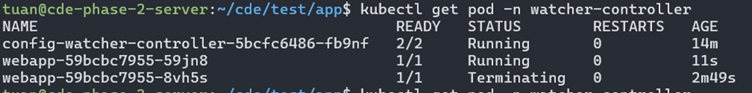

# Adding custom resource to Kubernetes

## 1. Introduction

Besides default resources such as Pod, ReplicaSet, Deployment, StatefulSet, etc., Kubernetes allows us to create additional custom resources to meet specific needs in our projects. For example, to create a PostgreSQL database in Kubernetes, you would first define a StatefulSet, then create a Service for that StatefulSet so that clients can connect to it. We can simplify this process by defining a custom resource called Postgres; each time a PostgreSQL database is needed, you simply create a Postgres custom resource, as shown below:

```
...
kind: Postgres
metadata:
name: test-db
storage: 50GB
```

## 2. Custom controller

Kubernetes is composed of four main components: etcd, API server, Controller Manager, and Scheduler. The Controller Manager is responsible for watching the API server and creating related resources. For example, the Deployment Controller watches the Deployment resource on the API server and creates the associated resources. In addition to the built-in Controller Managers, we can create a custom controller to serve a different purpose.

For instance, note that when you create a ConfigMap and assign it to a Pod, updating the ConfigMap with new values does not automatically update the Pod; the Pod continues using the old values. If you want the Pod to use the updated ConfigMap, you must delete the Pod so it is recreated with the new values. This process can be tedious. We can create a custom controller that automatically performs this task. Our custom controller will watch the ConfigMap resource on the API server, and if it detects a change in a ConfigMap that is being used by a Pod, it will automatically delete that Pod so that, if the Pod was created by a resource such as a ReplicaSet or Deployment, it gets recreated with the updated ConfigMap.

**_To create a custom controller, first you write code that watches the desired resource on the API server, then build it into an image, and finally create a Deployment that uses that image to deploy it on Kubernetes. Essentially, a custom controller is just a regular Deployment, except that you write the code to interact with the API server._**

### 2.1 Creating a Custom Controller

Now we will create a custom controller named `config-watcher-controller` that watches ConfigMaps. If any Pod uses a ConfigMap, when that ConfigMap is updated the new value will be propagated by deleting the old Pod so that it is recreated. The illustration of the config-watcher-controller is as follows:

<div align="center">
  
</div>

Now, let’s write the code and build the image for the config-watcher container. Create a file named `config-watcher-controller.sh` with the following content:

```
#!/bin/bash

# Controller script which watches configmaps and evaluates annotation
# on the ConfigMap for pods to restart

# Namespace to watch (or 'default' if not given)
namespace=${WATCH_NAMESPACE:-default}

# API URL setup. Requires an ambassador API proxy running side-by-side on localhost
base=http://localhost:8001
ns=namespaces/$namespace

# Main event loop
start_event_loop() {
  # Watch the K8s API on events on service objects
  echo "::: Starting to wait for events"

  # Event loop listening for changes in config maps
  curl -N -s $base/api/v1/${ns}/configmaps?watch=true | while read -r event
  do
    # Sanitize new lines
    event=$(echo "$event" | tr '\r\n' ' ')

    # Event type & name
    local type=$(echo "$event" | jq -r .type)
    local config_map=$(echo "$event" | jq -r .object.metadata.name)

    # Fetch annotations of ConfigMap and extract our trigger annotation if any
    # The extracted pod selector is expected to have
    # the format "label1=value1,label2=value2,.."
    local annotations=$(echo "$event" | jq -r '.object.metadata.annotations')
    if [ "$annotations" != "null" ]; then
      local pod_selector=$(echo $annotations | jq -r 'to_entries | .[] | select(.key == "k8spatterns.io/podDeleteSelector") | .value | @uri')
    fi
    echo "::: $type -- $config_map -- $pod_selector"

    # Act only when configmap is modified and an annotation has been given
    if [ $type = "MODIFIED" ] && [ -n "$pod_selector" ]; then
      delete_pods_with_selector "$pod_selector"
    fi
  done
}

# Delete all pods that match a selector
delete_pods_with_selector() {
  local selector=${1}

  echo "::::: Deleting pods with $selector"

  # Pick up all pod names which match the given selector
  local pods=$(curl -s $base/api/v1/${ns}/pods?labelSelector=$selector | \
               jq -r .items[].metadata.name)

  # Delete all pods that matched
  for pod in $pods; do
    # Delete but also check exit code
    exit_code=$(curl -s -X DELETE -o /dev/null -w "%{http_code}" $base/api/v1/${ns}/pods/$pod)
    if [ $exit_code -eq 200 ]; then
      echo "::::: Deleted pod $pod"
    else
      echo "::::: Error deleting pod $pod: $exit_code"
    fi
  done
}

# ==============================================
# Fire up
start_event_loop
```

The above code watches the ConfigMap on the API server using the command:

`curl -N -s $base/api/v1/${ns}/configmaps?watch=true | while read -r event`

When a change is detected in a ConfigMap, it executes the following code and, if it detects a modified ConfigMap with a triggering annotation, it deletes the corresponding Pod:

```
if [ $type = "MODIFIED" ] && [ -n "$pod_selector" ]; then
  delete_pods_with_selector "$pod_selector"
fi
```

Next, create a Dockerfile with the following content:

```
FROM alpine
WORKDIR /watcher
RUN apk add --update curl jq && rm -rf /var/cache/apk/*
COPY config-watcher-controller.sh .
ENTRYPOINT ["curl"]
```

Then build and push the image to Docker Hub:

```
$ docker build . -t tuanquang1811/configmap-watcher:v1
$ docker push tuanquang1811/configmap-watcher:v1

```

After this, create a file named config-watcher-controller.yaml with the following configuration:

```
# Service account required for watching to resources
apiVersion: v1
kind: ServiceAccount
metadata:
  name: config-watcher-controller
---

# Bind to 'edit' role to allow for watching resources and restarting pods
apiVersion: rbac.authorization.k8s.io/v1
kind: RoleBinding
metadata:
  name: config-watcher-controller
subjects:
- kind: ServiceAccount
  name: config-watcher-controller
roleRef:
  name: edit
  kind: ClusterRole
  apiGroup: rbac.authorization.k8s.io
---

# Controller with kubeapi-proxy sidecar for easy access to the API server
apiVersion: apps/v1
kind: Deployment
metadata:
  name: config-watcher-controller
spec:
  replicas: 1
  selector:
    matchLabels:
      app: config-watcher-controller
  template:
    metadata:
      labels:
        app: config-watcher-controller
    spec:
      # A serviceaccount is needed to watch events
      # and to allow for restarting pods. For now its
      # associated with the 'edit' role
      serviceAccountName: config-watcher-controller
      containers:
      - name: proxy
        image: 080196/kubeapi-proxy
      - name: config-watcher
        image: tuanquang1811/configmap-watcher:v1
        env:
         # The operator watches the namespace in which the controller
         # itself is installed (by using the Downward API)
         - name: WATCH_NAMESPACE
           valueFrom:
             fieldRef:
               fieldPath: metadata.namespace
        command:
        - "sh"
        - "/watcher/config-watcher-controller.sh"
```

In the above file, a dedicated ServiceAccount is created for the config-watcher-controller instead of using the default ServiceAccount, and a RoleBinding binds the edit role to this ServiceAccount to grant it permissions to modify resources within a namespace. In the Deployment configuration, the ServiceAccount is specified in the Pod template so that the container in the Pod can edit Kubernetes resources.

To deploy the controller, execute:

```
$ kubectl apply -f config-watcher-controller.yaml
serviceaccount/config-watcher-controller created
rolebinding.rbac.authorization.k8s.io/config-watcher-controller created
deployment.apps/config-watcher-controller created
```

### 2.2 Using the Custom Controller

Next, we will create a resource and test the custom controller. To use the config-watcher-controller, when declaring a ConfigMap, add an annotation with the value `k8spatterns.io/podDeleteSelector: "<key>=<value>"` where the key and value indicate the Pod label whose ConfigMap should be updated when the ConfigMap changes. Create a file named `confimap-watch.yaml` with the following content:

```
apiVersion: v1
kind: ConfigMap
metadata:
  name: webapp-config
  annotations:
    k8spatterns.io/podDeleteSelector: "app=webapp"
data:
  message: "Hello configmap watch one"
```

Apply it with:

```
$ kubectl apply -f confimap-watch.yaml
configmap/webapp-config created
```

Then create a file named `deploy-use-configmap-watcher.yaml`:

```
apiVersion: apps/v1
kind: Deployment
metadata:
  name: webapp
spec:
  replicas: 1
  selector:
    matchLabels:
      app: webapp
  template:
    metadata:
      labels:
        app: webapp
    spec:
      containers:
        - name: webapp
          image: alpine
          command: ["/bin/sleep", "999999"]
          envFrom:
            - configMapRef:
                name: webapp-config
```

Here, the Pod’s label matches the one defined in the ConfigMap. Create the Deployment and then access it to view the initial ConfigMap values. After that, update the ConfigMap and check if the Pod is automatically updated.

Get the environment variables in the Pod:

<div align="center">
  
</div>

Now, update the file `confimap-watch.yaml`:

```
apiVersion: v1
kind: ConfigMap
metadata:
  name: webapp-config
  annotations:
    k8spatterns.io/podDeleteSelector: "app=webapp"
data:
  message: "Hello configmap watch two"
```

Apply the update:

```
$ kubectl apply -f confimap-watch.yaml
configmap/webapp-config configured
```

At this point, if you list the Pods, you will see one Pod being deleted and a new one being created:

<div align="center">
  
</div>
When you access the new Pod and inspect it again, you will notice that its environment variables have been updated.

<div align="center">
  
</div>

## 3. Custom resource

After discussing custom controllers, we now turn to custom resources. To create a custom resource, use a CustomResourceDefinition (CRD). You write a CustomResourceDefinition to define the custom values for your resource, then create the CRD, and subsequently develop a controller to watch your new custom resource and perform related actions. For example, consider a file named `website-crd.yaml` with the following configuration for a CustomResourceDefinition:

```
apiVersion: apiextensions.k8s.io/v1
kind: CustomResourceDefinition
metadata:
  name: websites.extensions.example.com # The full name of your custom object
spec:
  scope: Namespaced # You want Website resources to be namespaced.
  group: extensions.example.com # Define an API group and version of the Website resource.
  versions:
    - name: v1
      served: true
      storage: true
      schema:
        openAPIV3Schema:
          type: object
          properties:
            spec:
              type: object
              properties:
                gitRepo:
                  type: string
  names: # You need to specify the various forms of the custom object’s name.
    kind: Website
    singular: website
    plural: websites
```

In the above file, the group and version fields define the API group and version for this resource on the API server. In this case, they are set to `extensions.example.com` and `v1`, so when creating a resource, set the apiVersion to `extensions.example.com/v1`. The names field defines the kind as well as the singular and plural identifiers for the custom resource. With these settings, you can run kubectl get website to list all Website resources.

Create the CustomResourceDefinition with:

```
$ kubectl apply -f website-crd.yaml
customresourcedefinition.apiextensions.k8s.io/websites.extensions.example.com created
```

Now that the custom resource is defined on the API server, to create an instance of this resource, create a file named `website.yaml` with the following content:

```
apiVersion: extensions.example.com/v1
kind: Website
metadata:
  name: kubia
spec:
  gitRepo: https://github.com/luksa/kubia-website-example.git
```

```
$ kubectl apply -f website.yaml
website.extensions.example.com/kubia created
```

Now the custom resource is set up. To interact with it, you can use typical resource commands:

```
$ kubectl get website
NAME    AGE
kubia   71s

$ kubectl delete website kubia
website.extensions.example.com "kubia" deleted
```

Thus, our custom resource has been successfully created, though it does not perform any actions by itself. To make the resource functional, you need to create a controller for it. We want our Website resource to work as follows: you define a Website resource with the URL to the GitLab repository for the static website you need to deploy, then create the Website resource. The controller will watch for new Website resources, create a Deployment to deploy a Pod running the static website, and subsequently create a Service to expose the website traffic to clients.

<div align="center">
  
</div>

Create a controller named `website-controller.yaml` with the following configuration:

```
apiVersion: apps/v1
kind: Deployment
metadata:
  name: website-controller
spec:
  replicas: 1
  selector:
    matchLabels:
      app: website-controller
  template:
    metadata:
      name: website-controller
      labels:
        app: website-controller
    spec:
      serviceAccountName: website-controller
      containers:
        - name: main
          image: luksa/website-controller
        - name: proxy
          image: luksa/kubectl-proxy:1.6.2
```

<div align="center">
  
</div>

The operation of the website-controller container is similar to the ConfigMap watch controller described earlier.

<div align="center">
  
</div>

The code is available on this GitHub repository: https://github.com/luksa/k8s-website-controller. Now, create the Website resource again to see it in action:

<div align="center">
  
</div>

Thus, the custom resource and its controller are working correctly. Instead of creating separate Deployments and Services each time, you only need to define a CRD.
