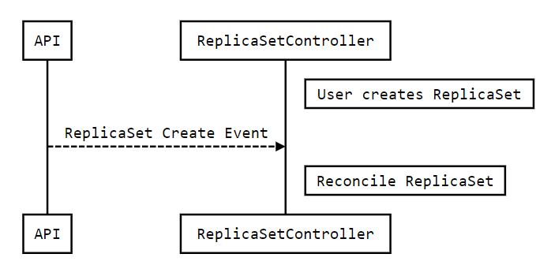
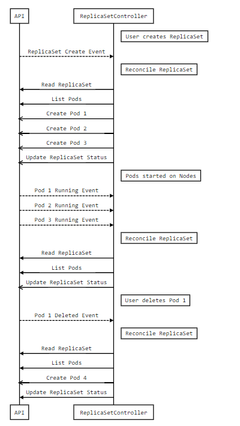

# Kubernetes controllers

## 1. What is a Controller

Controllers implement APIs defined by Resources. Unlike Controllers in the ModelViewController pattern, Kubernetes Controllers are run asynchronously after the Resources (Models) have been written to storage. This model is highly flexible and allows new Controllers to be added for Models through extension instead of modification.

A Kubernetes Controller is a routine running in a Kubernetes cluster that watches for create / update / delete events on Resources, and triggers a Reconcile function in response. Reconcile is a function that may be called at any time with the Namespace and Name of an object (Resource instance), and it will make the cluster state match the state declared in the object Spec. Upon completion, Reconcile updates the object Status to the new actual state.

It is common for Controllers to watch for changes to the Resource type that they Reconcile and Resource types of objects they create. e.g. a ReplicaSet Controller watches for changes to ReplicaSets and Pods. The Controller will trigger a Reconcile for a ReplicaSet in response to either an event for that ReplicaSet or in response to an event for a Pod created by that ReplicaSet.

In some cases Reconcile may only update the Status without updating any cluster state.

Illustrative example:

- A ReplicaSet object is created with 10 replicas specified in the Spec
- ReplicaSetController Reconcile reads the Spec and lists the Pods owned by the ReplicaSet
- No Pods are found, ReplicaSetController creates 10 Pods and updates the Status with 0/10 Pods running
- ReplicaSetController Reconcile is triggered as the - - Pods start running, and updates Status in the ReplicaSet object.

**Kubernetes APIs and Controllers have level based implementations to facilitate self- healing and periodic reconciliation. This means no state is provided to the Reconcile when it is called.**

### 1.1 What is a Level Based API

The term level-based comes from interrupts hardware, where interrupts may be either level-based or edge-based.

Kubernetes defines a level-based API as implemented by reading the observed (actual) state of the system, comparing it to what is declared in the object Spec, and making changes to the system state so it matches the state of the Spec at the time Reconcile is called.

This has a number of notable properties:

- Reconcile skips intermediate or obsolete values declared in the Spec and works directly toward the current Spec.
- Reconcile may batch multiple events together before processing them instead of handling each individually

Consider the following examples of level based API implementations.

**_Example 1: Batching Events_**

A user creates a ReplicaSet with 1000 replicas. The ReplicaSet creates 1000 Pods and maintains a Status field with the number of healthy Pods. In a level based system, the Controller batches the Pod updates together (the Reconcile only gets the ReplicaSet Namespace and Name) before triggering the Reconcile. In an edge based system, the Controller responds to each individual Pod event, potentially performing 1000 sequential updates to the Status instead of 1.

**_Example 2: Skipping Obsolete States_**

A user creates a rollout for a Deployment containing a new container image. Shortly after starting the rollout, the user realizes the containers are crash looping because they need to increase memory thresholds when running the new image. The user updates the Deployment with the new memory limit to start a new rollout. In a level based system, the Controller will immediately stop rolling out the old values and start the rollout for the new values. In an edge based system the Controller may complete the first rollout before starting the next

### 1.2 Watching Events

The Controller Reconcile is triggered by cluster events.

**Watching Resources**
Controllers must watch for events for the Resource they Reconcile. The ReplicaSetController watches for changes to ReplicaSets and triggers a Reconcile in response.

**_ReplicaSet Creation_**
The following diagram shows a creation event triggering a reconcile.

  

**Watching Created Resources**
Controllers should watch for events on the Resources they create. The ReplicaSetController watches for Pod events. If a Pod is deleted, the ReplicaSetController will see the Pod event and Reconcile the ReplicaSet that created the Pod so it can create a new one.

**_ReplicaSet Creation And Self-Healing_**
The following diagram shows a series of events after creating a new ReplicaSet and then a Pod getting deleted.

  

### 1.3 Create Objects During Reconciliation

Many Controllers create new Kubernetes objects as part of a reconcile. These objects are owned by the object responsible for their creation. This relationship is recorded both in an OwnersReference in the ObjectMeta of the created objects and through labels (on the created object) + selectors (on the created object).

The labels + selectors allow the creating controller to find all of the objects it has created, by listing them using their label. The OwnersReference maps the created object to its owner when there is an event for the created object.

### 1.4 Writing Status Back to Objects

Controllers are run asynchronously, meaning that the user operation will return a success to the user before the Controller is run. If there are issues when the Controller is run, such as the container image being invalid, the user will not be notified.

Instead the Controller must write back the Status of the object at each Reconcile and users must check the object Status.

## 2. How to deploy the controller to a Kuberetes cluster

Deploying controller to a Kubernetes cluster, generally need to follow these steps:

1. Define the Controller:
   - Write a Controller: A controller is typically written in Go and is part of a Kubernetes Operator. You can use tools like [Kubebuilder](https://book.kubebuilder.io/) to scaffold a new controller.
   - Define a Custom Resource Definition (CRD): Controllers usually manage custom resources. You’ll need to define a CRD that describes the schema of the custom resource.
2. Build and Package the Controller:
   - Containerize the Controller: Once the controller is written, you need to containerize it using Docker. The controller image will then be pushed to a container registry like Docker Hub.
   - Push the Image: Push the Docker image to your preferred container registry.
3. Deploy the CRD to the Cluster
   - Apply the CRD YAML file to the cluster `kubectl apply -f crd.yaml`
4. Deploy the Controller to the Cluster:
   - Create a Deployment: Define a Kubernetes Deployment for the controller, specifying the image you built earlier.
   - Apply the Deployment: Apply the Deployment to the cluster `kubectl apply -f controller-deployment.yaml`

[Deploying the controller to a Kubernetes cluster with Kubebuilder]()
