# Deploy CDE on K8S cluster public

After reviewing the architecture and the open-source projects used to deploy CDE and after testing it in a local environment, we now proceed to install and test it on a public Kubernetes cluster.

**Chuẩn bị**

# Deploy CDE on K8S Cluster Public

After reviewing the architecture and the open-source projects used to deploy CDE and after testing it in a local environment, we now proceed to install and test it on a public Kubernetes cluster.

**Preparation**

1. A public Kubernetes cluster with 1 master and 2 workers

<div align="center">
  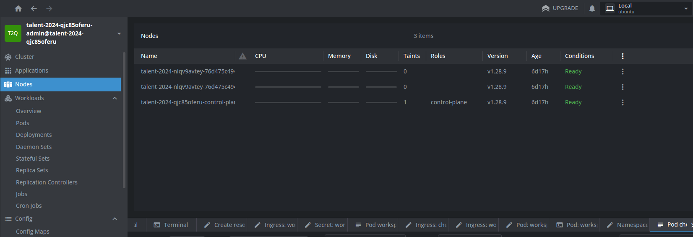
</div>

<br>

Kubeconfig file:

````yaml
apiVersion: v1
clusters:
  - cluster:
      certificate-authority-data: <<certificate-authority-data>>
      server: https://117.1.28.67:6443
    name: talent-2024-qjc85oferu
contexts:
  - context:
      cluster: talent-2024-qjc85oferu
      user: talent-2024-qjc85oferu-admin
    name: talent-2024-qjc85oferu-admin@talent-2024-qjc85oferu
current-context: talent-2024-qjc85oferu-admin@talent-2024-qjc85oferu
kind: Config

<div align="center">
  
</div>

<br>

file kubeconfig

```yaml
apiVersion: v1
clusters:
  - cluster:
      certificate-authority-data: <<certificate-authority-data>>
      server: https://117.1.28.67:6443
    name: talent-2024-qjc85oferu
contexts:
  - context:
      cluster: talent-2024-qjc85oferu
      user: talent-2024-qjc85oferu-admin
    name: talent-2024-qjc85oferu-admin@talent-2024-qjc85oferu
current-context: talent-2024-qjc85oferu-admin@talent-2024-qjc85oferu
kind: Config
preferences: {}
users:
  - name: talent-2024-qjc85oferu-admin
    user:
      client-certificate-data: <<client-certificate-data>>
      client-key-data: <<client-key-data>>
````

2. 1 public domain
`cde-vdt.online`
<div align="center">
  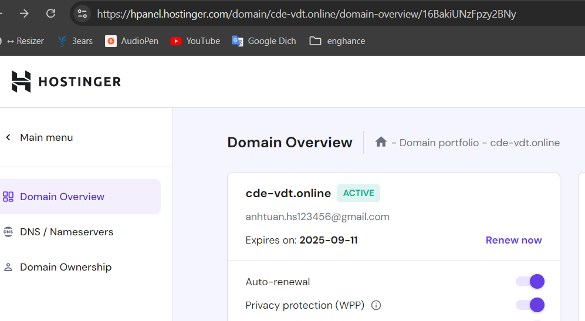
</div>

## 1. Installing Ingress-nginx controller

**_Installing with Helm_**

```
helm upgrade --install ingress-nginx ingress-nginx \
  --repo https://kubernetes.github.io/ingress-nginx \
  --namespace ingress-nginx --create-namespace
```

It will install the controller in the ingress-nginx namespace, creating that namespace if it doesn't already exist.

**_Installing with YAML manifest_**

```
kubectl apply -f https://raw.githubusercontent.com/kubernetes/ingress-nginx/controller-v1.11.2/deploy/static/provider/cloud/deploy.yaml
```

<br>

After installation, check the cluster for the resources in the `ingress-nginx` namespace. In particular, the service `ingress-nginx-controller` is exposed externally as a LoadBalancer with an external IP of `117.1.28.84`.

<div align="center">
  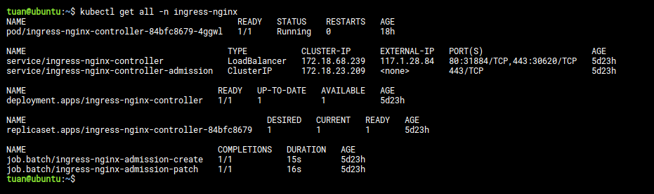
</div>
<br>

Next, point your domain to the external IP `117.1.28.84 of` the `ingress-nginx-controller`. Create two A-type DNS records with names `@` and `*` so that `cde-vdt.online` and all its subdomains (e.g. \*.cde-vdt.online) point to the IP `117.1.28.84`.

<div align="center">
  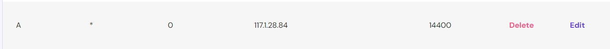
</div>

<div align="center">
  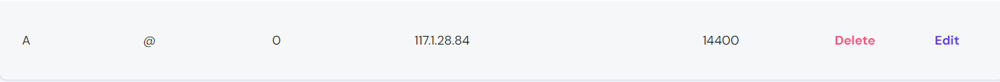
</div>

## 2. Installing cert-manager

The default static configuration can be installed as follows:

```
kubectl apply -f https://github.com/cert-manager/cert-manager/releases/download/v1.15.3/cert-manager.yaml
```

<div align="center">
  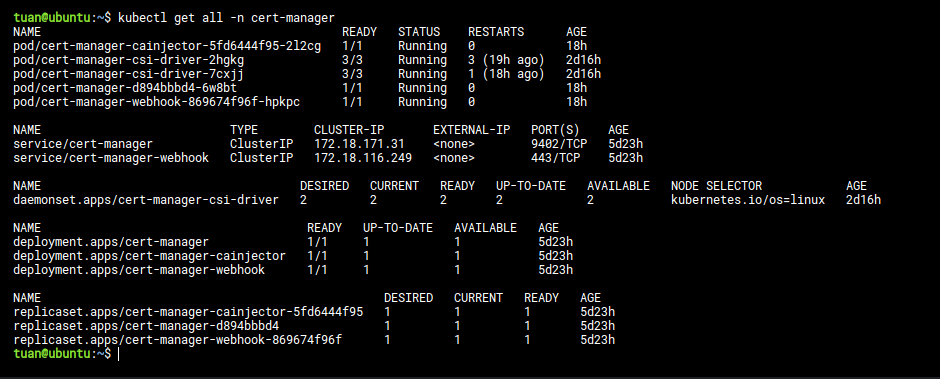
</div>

<br>

After installing `cert-manager`, create an `Issuer` or `ClusterIssuer` (a Cert-Manager CRD) for managing certificates. You need to create an `Issuer` or `ClusterIssuer` for [Let's Encrypt](https://cert-manager.io/docs/tutorials/acme/nginx-ingress/). There are two types for Let's Encrypt: staging (test) and production. Below are two YAML files that create a ClusterIssuer named letsencrypt-staging and one named letsencrypt-prod.

`ClusterIssuer` named `letsencrypt-staging` and `letsencrypt-prod`

```yaml
apiVersion: cert-manager.io/v1
kind: ClusterIssuer
metadata:
  name: letsencrypt-staging
spec:
  acme:
    # Let's Encrypt ACME server
    server: https://acme-staging-v02.api.letsencrypt.org/directory
    email: quangtuanitmo18@gmail.com
    privateKeySecretRef:
      name: letsencrypt-prod
    solvers:
      - http01:
          ingress:
            class: nginx
```

```yaml
apiVersion: cert-manager.io/v1
kind: ClusterIssuer
metadata:
  name: letsencrypt-prod
spec:
  acme:
    # Let's Encrypt ACME server
    server: https://acme-v02.api.letsencrypt.org/directory
    email: quangtuanitmo18@gmail.com
    privateKeySecretRef:
      name: letsencrypt-prod
    solvers:
      - http01:
          ingress:
            class: nginx
```

After applying these YAML files, you should see the corresponding resources created:

<div align="center">
  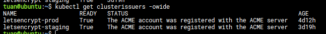
</div>

<br>

Now that you have a ClusterIssuer, simply add a `tls` spec in your ingress configuration and a certificate will be issued for HTTPS.

For example, here is an ingress configuration for an `nginx` service:

```yaml
apiVersion: networking.k8s.io/v1
kind: Ingress
metadata:
  name: nginx-ingress
  annotations:
    nginx.ingress.kubernetes.io/rewrite-target: /
    cert-manager.io/cluster-issuer: "letsencrypt-prod"
    nginx.ingress.kubernetes.io/force-ssl-redirect: "true"
spec:
  ingressClassName: nginx # Sử dụng Ingress class của Nginx
  tls:
    - hosts:
        - cde-vdt.online # Subdomain của bạn
      secretName: cde-vdt-online-tls # Secret sẽ chứa chứng chỉ SSL
  rules:
    - host: cde-vdt.online
      http:
        paths:
          - path: /
            pathType: Prefix
            backend:
              service:
                name: nginx-service
                port:
                  number: 80
```

After the configuration is complete, Cert-Manager will automatically issue a certificate from Let's Encrypt.

`kubectl describe certificate cde-vdt-online-tls`

Access the link `cde-vdt.online` from your browser and you will see that a certificate has been issued to enable HTTPS.

<div align="center">
  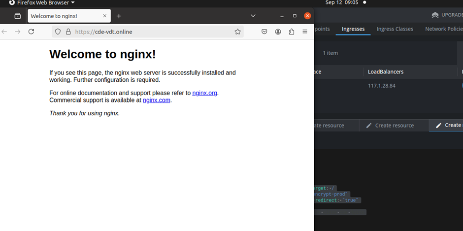
</div>

## 3. Installing DEX oidc

This allows us to authenticate to the Kubernetes API server using another identity provider. Using Dex allows for multiple, pluggable identity backends.

I started using dex because it allowed me to add LDAP to Kubernetes, but for this demo I'll use GitHub as the AuthN of choice.

If you don't want to extend the Kubernetes API AuthN - but still want AuthN at the ingress, consider using something a bit more basic "on-top" like: https://github.com/oauth2-proxy/oauth2-proxy. It could be layered via ingress annotations. The key difference is authenticating to applications on the cluster or authenticating to the Kubernetes API server.

Using GitHub as the OIDC identity provider, means I can create Kubernetes RBAC (AuthZ) about GitHub OIDC claims. "Anyone" I grant access to, with a valid GitHub login and a correctly configured kubectl config could access my cluster. The key point is that it's only who: "I grant access to."

It's important to understand the flow:

> staticClient (kube-login or UI) -> dex (oidc) -> GitHub (oidc) -> dex (oidc) -> refreshed credentials (to API / staticClient)

### 3.1 Setup an OAuth app in Github

`GitHub > Settings > Developer Settings > OAuth Apps > Register a new application`

Here, set the homepage URL to `https:dex3.cde-vdt.online`

<div align="center">
  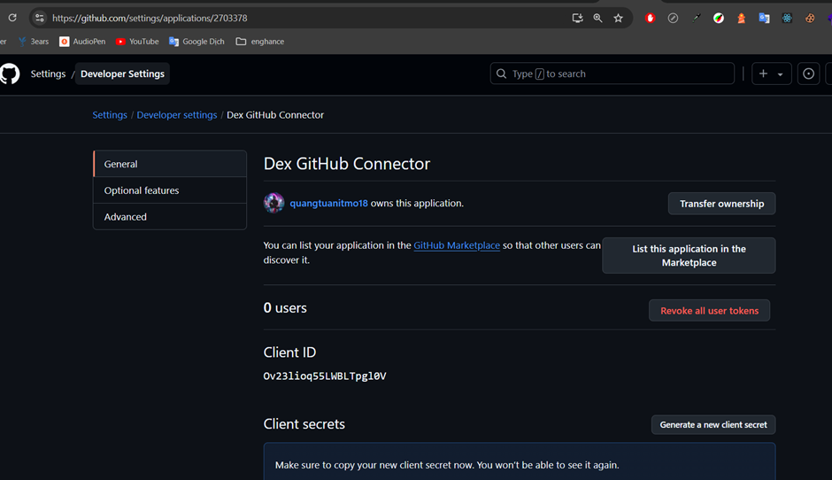
</div>

<div align="center">
  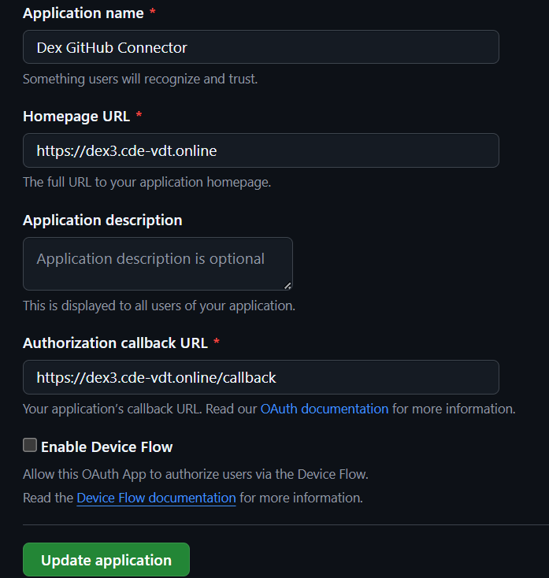
</div>

Obtain and save the clientID and Secret for later use.

### 3.2 Setup Kubernetes API servers

Adding these flags, assuming no typos, should have no impact to the existing behavior of your API server. We're adding AuthN methods and not removing anything. It can be done before we actually have oidc setup completely.

We need to instruct the API server to support our OIDC source. Assuming you're using Let's Encrypt for the dex (OIDC) HTTPS endpoint, let's create the CA cert. We do this so the API server can leverage our OIDC configuration and "trust" LetsEncrypt as the issuing CA.

To update the API server, modify the static manifest (/etc/kubernetes/manifests/kube-apiserver.yaml) which kubelet automatically reads when changed. Note that any typo here could prevent the API server from starting and it might be worth backing up the file (or rebuilding).

```
# ssh into the control plane node

# copy the letsencrypt cert stack to the node
curl https://letsencrypt.org/certs/isrgrootx1.pem.txt > isrgrootx1.pem.txt
curl https://letsencrypt.org/certs/lets-encrypt-x3-cross-signed.pem.txt > lets-encrypt-x3-cross-signed.pem.txt
cat isrgrootx1.pem.txt lets-encrypt-x3-cross-signed.pem.txt > letsencrypt.pem

# move cert to kubernetes pki
cp letsencrypt.pem /etc/kubernetes/pki/letsencrypt.pem
```

This can be setup without impact to existing auth / access. The flags configure the Kubernetes API server for OIDC but since we don't use OIDC for AuthN - there is no impact.

<div align="center">
  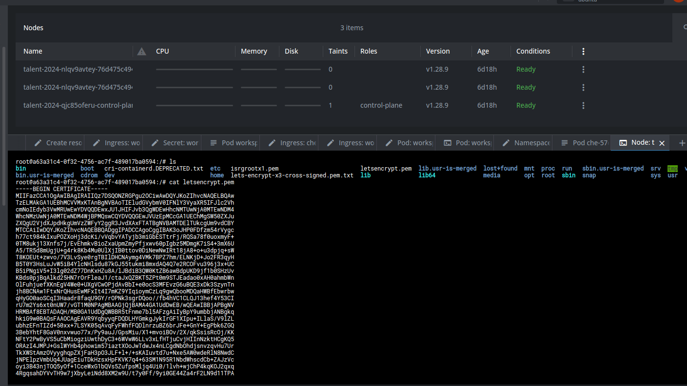
</div>

```
# update the API server configuration
vi /etc/kubernetes/manifests/kube-apiserver.yaml

# insert / copy the following to the bottom of `spec.containers.command:`

    - --oidc-ca-file=/etc/kubernetes/pki/letsencrypt.pem
    - --oidc-client-id=cde-vdt
    - --oidc-groups-claim=groups
    - --oidc-issuer-url=https://dex3.cde-vdt.online
    - --oidc-username-claim=email

# confirm the API server is running (it should exist and have been recently restarted)
sudo crictl ps | grep api

# return to your local shell
exit
```

### 3.3 Install DEX

Install Dex via Helm.

Run the following command to add the Dex repository to Helm:

`helm repo add dex https://charts.dexidp.io`

Then install Dex with Helm using the following values file:

```yaml
https:
  enabled: true

ingress:
  enabled: true
  className: nginx
  annotations:
    cert-manager.io/cluster-issuer: "letsencrypt-prod"
    nginx.ingress.kubernetes.io/ssl-redirect: "false"
    nginx.ingress.kubernetes.io/force-ssl-redirect: "false"
  hosts:
    - host: dex3.cde-vdt.online # Thay thế example.com bằng domain của bạn
      paths:
        - path: /
          pathType: ImplementationSpecific
  tls:
    - secretName: dex-cde-vdt-tls
      hosts:
        - dex3.cde-vdt.online # Thay thế example.com bằng domain của bạn

volumes:
  - name: tls
    csi:
      driver: csi.cert-manager.io
      readOnly: true
      volumeAttributes:
        "csi.cert-manager.io/issuer-name": "letsencrypt-prod"
        "csi.cert-manager.io/issuer-kind": "ClusterIssuer"
        "csi.cert-manager.io/dns-names": "dex3.cde-vdt.online" # Thay thế example.com
        "csi.cert-manager.io/certificate-file": "tls.crt"
        "csi.cert-manager.io/privatekey-file": "tls.key"

volumeMounts:
  - name: tls
    mountPath: /etc/crt
    readOnly: true

config:
  enablePasswordDB: false
  storage:
    type: memory
  web:
    https: 0.0.0.0:5554
    tlsCert: /etc/crt/tls.crt
    tlsKey: /etc/crt/tls.key
  issuer: https://dex3.cde-vdt.online # Thay thế example.com
  connectors:
    - type: github
      id: github
      name: GitHub
      config:
        clientID: Ov23lioq55LWBLTpgl0V # Đặt giá trị của CLIENT_ID
        clientSecret: 3e7824f9864cfa6ae6239e48630fa0c0fee7fe2b # Đặt giá trị của CLIENT_SECRET
        redirectURI: https://dex3.cde-vdt.online/callback # Thay thế example.com
  staticClients:
    - id: cde-vdt
      redirectURIs:
        - http://localhost:8000
        - http://localhost:18000
        - http://127.0.0.1:5555/callback
        - https://cde-vdt.online/oauth/callback
      name: Testing OIDC
      secret: ZXhhbXBsZS1hRANDOMSTRINGcHAtc2VjcmV0

# Ingress annotations
extraIngressAnnotations:
  nginx.ingress.kubernetes.io/ssl-passthrough: "true"
```

Run the following command to install Dex on your cluster:
`helm install dex dex/dex --values values.yaml -n dex`

After installing Dex, access the link `https://dex3.cde-vdt.online/.well-known/openid-configuration` to verify the configuration.

<div align="center">
  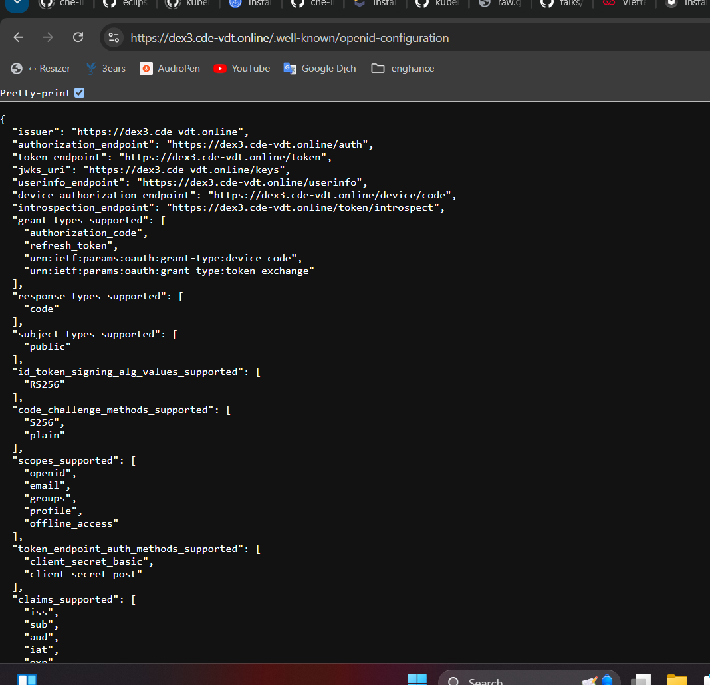
</div>

### 3.4 Test with kubelogin

Putting it all together, use [kubelogin](https://github.com/int128/kubelogin), a kubectl plugin for Kubernetes OpenID Connect authentication (kubectl oidc-login).

Installing the plugin with `brew` automatically adds it to my path and I can leverage it by updating my kubeconfig.

```
# install kubelogin
brew install int128/kubelogin/kubelogin
```

Create a KUBECONFIG user named oidc ("set-credentials") with our config. This does not overwrite your current user and you can switch between users for testing.

```
# create a user named "oidc"
kubectl config set-credentials oidc \
  --exec-api-version=client.authentication.k8s.io/v1beta1 \
  --exec-command=kubectl \
  --exec-arg=oidc-login \
  --exec-arg=get-token \
  --exec-arg=--oidc-issuer-url="https://dex3.cde-vdt.online" \
  --exec-arg=--oidc-client-id="cde" \
  --exec-arg=--oidc-extra-scope="email" \
  --exec-arg=--oidc-client-secret="ZXhhbXBsZS1hRANDOMSTRINGcHAtc2VjcmV0"
```

now have 2 users in your KUBECONFIG ("oidc" and "talent-2024-qjc85oferu-admin"). Let's switch to our user for testing:

```
# switch to the oidc user
kubectl config set-context --current --user=oidc

# should open a browser to login
kuebctl get pods -A
error: You must be logged in to the server (Unauthorized)
```

As expected, since we don't have any permissions. Let's give us some:

```
# switch back to working cluster admin
kubectl config set-context --current --user=talent-2024-qjc85oferu-admin

# create cluster role binding for testing using my GitHub email as the user scope
kubectl create clusterrolebinding oidc-cluster-admin --clusterrole=cluster-admin --user='quangtuanitmo18@gmail.com'
```

Test again with the `oidc` user (now that it has permissions):

```
# use the oidc user
kubectl config set-context --current --user=oidc

# get all pods
kubectl get pods -A
```

A GitHub login prompt should appear (since GitHub is used as the connector). After authentication via GitHub, Dex grants the user's permissions.

<div align="center">
  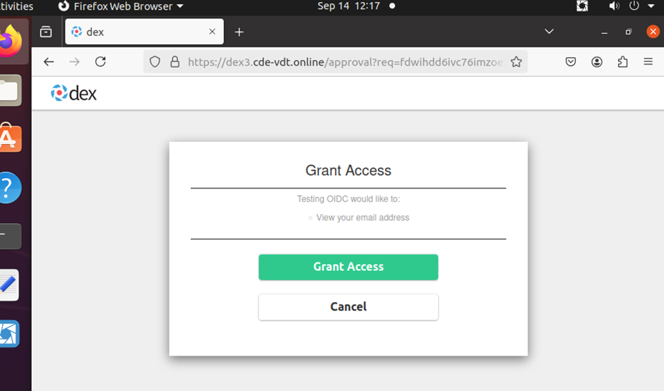
</div>

<div align="center">
  
</div>

Once the user is authenticated, listing pods will produce the expected output:

<div align="center">
  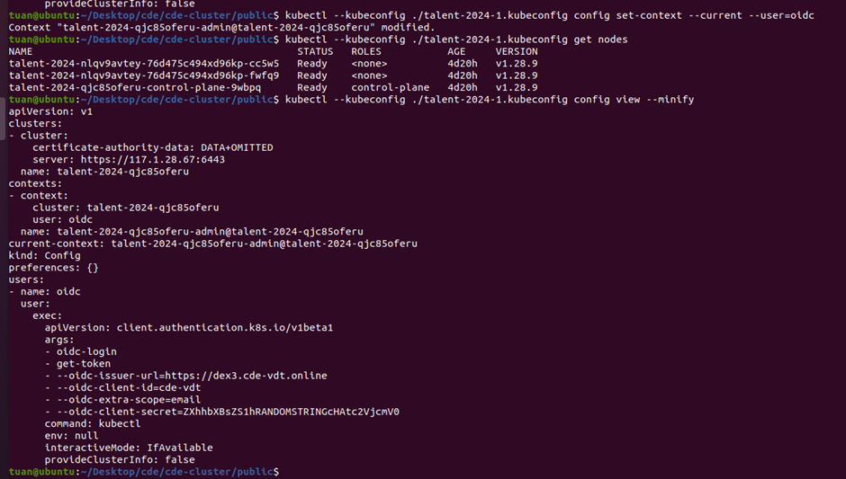
</div>

### 3. Installing Eclipse-che

Next, install Eclipse Che using chectl. First, install chectl.

**_Prerequisites_**

- The directory /usr/local/bin is in the user $PATH.

- The sudo command is configured for the current user.

- No old or undesired versions of chectl present on the system.

**_Procedure_**

1.  Run the following command in the terminal (this downloads and executes the install.sh script):

    ```
    $ bash <(curl -sL https://che-incubator.github.io/chectl/install.sh)
    ```

2.  Run the following command to verify that the chectl tool is available at `/usr/local/bin/chectl`:

    ```
    $ which chectl
    /usr/local/bin/chectl
    ```

3.  Run the following command to verify that the version of chectl that is the expected one.
    ```
    $ chectl --version
    ```

Next, deploy Eclipse Che using chectl with the file `che-cluster-patch.yaml` shown below:

```yaml
spec:
  networking:
    auth:
      identityProviderURL: "https://dex3.cde-vdt.online"
      oAuthClientName: "cde-vdt"
      oAuthSecret: "ZXhhbXBsZS1hRANDOMSTRINGcHAtc2VjcmV0"
      oAuthScope: "openid email profile"
      gateway:
        deployment:
          containers:
            - env:
                - name: OAUTH2_PROXY_INSECURE_OIDC_ALLOW_UNVERIFIED_EMAIL
                  value: "true"
              name: oauth-proxy
    tlsSecretName: "che-tls"
  components:
    cheServer:
      extraProperties:
        CHE_OIDC_AUTH__SERVER__URL: "https://dex3.cde-vdt.online"
        CHE_OIDC_USERNAME__CLAIM: email
        CHE_OIDC_GROUPS__CLAIM: groups
```

Deploy Eclipse Che with the following command (for details, refer to [here](https://github.com/che-incubator/chectl)):

```
chectl server:deploy \
       --platform=k8s \
       --che-operator-cr-patch-yaml=che-cluster-patch.yaml \
       --skip-cert-manager \
       --domain=cde-vdt.online
```

After deploying Che, run the command `chectl dashboard:open` to open the Eclipse Che dashboard.

You will then be redirected to Dex to grant the necessary permissions.

<div align="center">
  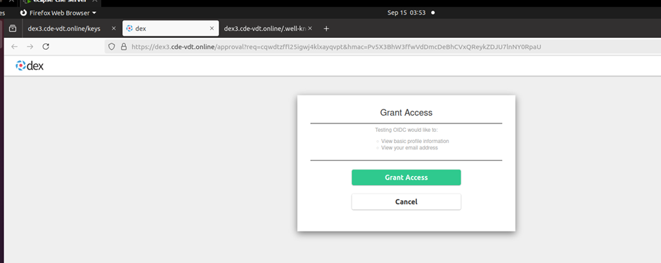
</div>

After permission is granted, you will be redirected back to the Eclipse Che dashboard.

<div align="center">
  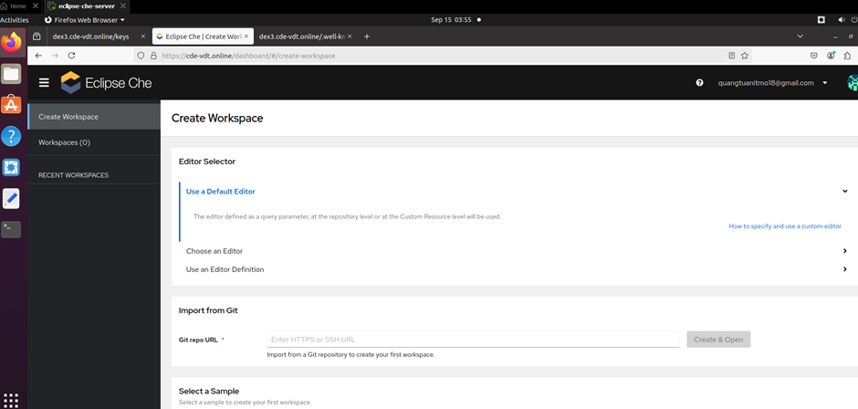
</div>

<br>

Now, create a development workspace as a test. Create a dev workspace from the GitHub repository `https://github.com/quangtuanitmo18/quarkus-api-example` which already contains a devfile.

The devfile defines three main components in the workspace:

**components**

1. tools (container):

   - image: Uses quay.io/devfile/universal-developer-image:ubi8-latest, which is a popular development environment.
   - env: Environment variables for this container:
     QUARKUS_HTTP_HOST: Set to 0.0.0.0 so Quarkus listens on all network interfaces.
   - endpoints:
     Debug port (5005/tcp) used for debugging Quarkus. This port is not public.
     Public port list-all-food (8080/http), which serves the Quarkus web API at /food.
   - memoryLimit: 6G.
   - mountSources: Mounts the project source code into the container.

2. postgresql (container):

   - Image: Uses quay.io/centos7/postgresql-13-centos7.
   - env: Environment variables to configure PostgreSQL:
     POSTGRESQL_USER, POSTGRESQL_PASSWORD, POSTGRESQL_DATABASE: Set the login information and database name.
   - PGDATA: Sets the PostgreSQL data storage path to /tmp/pgdata.

3. ubi-minimal (container):

   - Image: Uses registry.access.redhat.com/ubi8/ubi-minimal, a minimal image from Red Hat.
   - ommand and args: This container will run tail -f /dev/null to keep it active without doing anything else.
   - memoryLimit: 64M.
   - mountSources: Mounts the source code into the container.

**commands**

The devfile defines several commands to perform various tasks:

1. package

   - This command builds the Quarkus application without running tests (./mvnw clean package -DskipTests=true).
   - This is the default build command for the workspace (isDefault: true).

2. runtests

   - This command runs the project tests (./mvnw test).

3. packagenative

   - Builds the Quarkus application into a native image (./mvnw package -Dnative) with a memory limit of 3G.

4. buildimage
   - Builds a Docker image for the application using Podman (podman build).
5. loginlocalregistry

   - Logs in to the internal OpenShift registry using Podman (podman login).

6. pushimage
   - Pushes the built image to the OpenShift registry (podman push).
7. startdev
   - Starts Quarkus in development mode with hot reload and debug support (./mvnw compile quarkus:dev).
   - This is the default run command for the application (isDefault: true).
8. startnative
   - Runs the native version of the application (./quarkus-api-example-1.0.0-SNAPSHOT-runner) in the ubi-minimal container.

```yaml
schemaVersion: 2.1.0
metadata:
  generateName: quarkus-api-example-demo
attributes:
  controller.devfile.io/storage-type: ephemeral
components:
  - name: tools
    container:
      image: quay.io/devfile/universal-developer-image:ubi8-latest
      env:
        - name: QUARKUS_HTTP_HOST
          value: 0.0.0.0
      endpoints:
        - exposure: none
          name: debug
          protocol: tcp
          targetPort: 5005
        - exposure: public
          name: list-all-food
          protocol: http
          targetPort: 8080
          path: /food
      memoryLimit: 6G
      mountSources: true

  - name: postgresql
    container:
      image: "quay.io/centos7/postgresql-13-centos7@sha256:994f5c622e2913bda1c4a7fa3b0c7e7f75e7caa3ac66ff1ed70ccfe65c40dd75"
      env:
        - name: POSTGRESQL_USER
          value: user
        - name: POSTGRESQL_PASSWORD
          value: password
        - name: POSTGRESQL_DATABASE
          value: food_db
        - name: PGDATA
          value: /tmp/pgdata

  - name: ubi-minimal
    container:
      image: registry.access.redhat.com/ubi8/ubi-minimal
      command: ["tail"]
      args: ["-f", "/dev/null"]
      memoryLimit: 64M
      mountSources: true
commands:
  - id: package
    exec:
      label: "Package"
      component: tools
      workingDir: ${PROJECT_SOURCE}
      commandLine: "./mvnw clean package -DskipTests=true -Dquarkus.profile=staging"
      group:
        kind: build
        isDefault: true
  - id: runtests
    exec:
      label: "Run tests"
      component: tools
      workingDir: ${PROJECT_SOURCE}
      commandLine: "./mvnw test"
      group:
        kind: test
  - id: packagenative
    exec:
      label: "Package Native"
      component: tools
      workingDir: ${PROJECT_SOURCE}
      commandLine: "./mvnw package -Dnative -Dmaven.test.skip -Dquarkus.native.native-image-xmx=3G  -Dquarkus.profile=staging"
      group:
        kind: build
  - id: buildimage
    exec:
      label: "Build Image"
      component: tools
      workingDir: ${PROJECT_SOURCE}
      commandLine: "podman build -f src/main/docker/Dockerfile.jvm -t image-registry.openshift-image-registry.svc:5000/openshift/quarkus-api-example ."
      group:
        kind: build
  - id: loginlocalregistry
    exec:
      label: "Login to local OpenShift registry"
      component: tools
      workingDir: ${PROJECT_SOURCE}
      commandLine: "podman login --tls-verify=false -u kubeadmin -p $(oc whoami -t) image-registry.openshift-image-registry.svc:5000"
      group:
        kind: run
  - id: pushimage
    exec:
      label: "Push Image"
      component: tools
      workingDir: ${PROJECT_SOURCE}
      commandLine: "podman push --tls-verify=false image-registry.openshift-image-registry.svc:5000/openshift/quarkus-api-example"
      group:
        kind: build
  - id: startdev
    exec:
      label: "Start Development mode (Hot reload + debug)"
      component: tools
      workingDir: ${PROJECT_SOURCE}
      commandLine: "./mvnw compile quarkus:dev"
      group:
        kind: run
        isDefault: true
  - id: startnative
    exec:
      label: "Start Native"
      component: ubi-minimal
      workingDir: ${PROJECT_SOURCE}/target
      commandLine: "./quarkus-api-example-1.0.0-SNAPSHOT-runner"
      group:
        kind: run
```

You can create a dev workspace on the Eclipse Che dashboard or access the link
`https://cde-vdt.online/#https://github.com/quangtuanitmo18/quarkus-api-example`

The link will have the following structure:

<div align="center">
  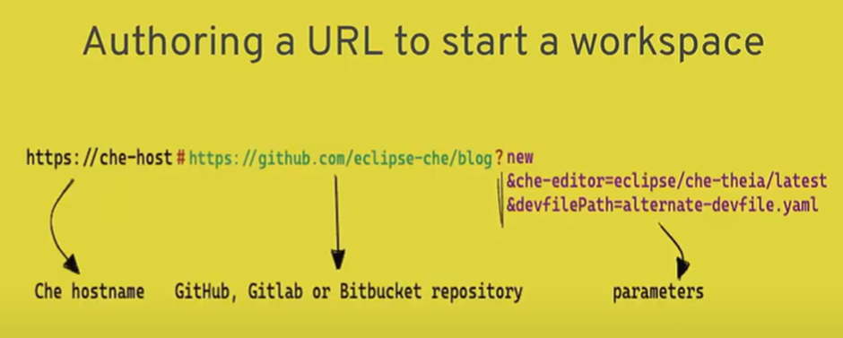
</div>

The workspace creation process will then proceed:

<div align="center">
  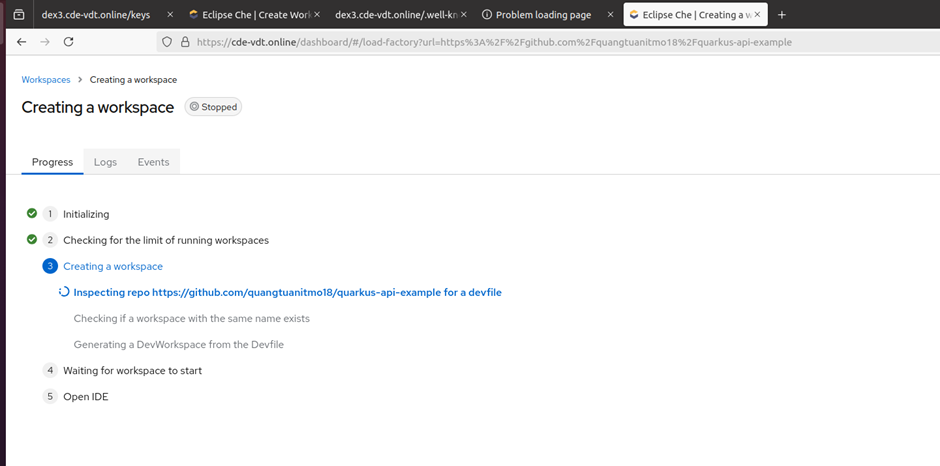
</div>

Once created, you will have a browser-based code environment:

<div align="center">
  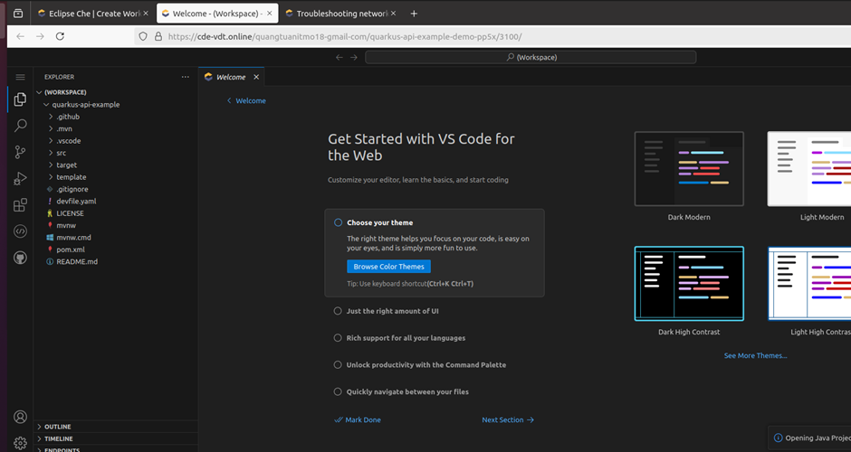
</div>

Check the commands defined in the devfile:

<div align="center">
  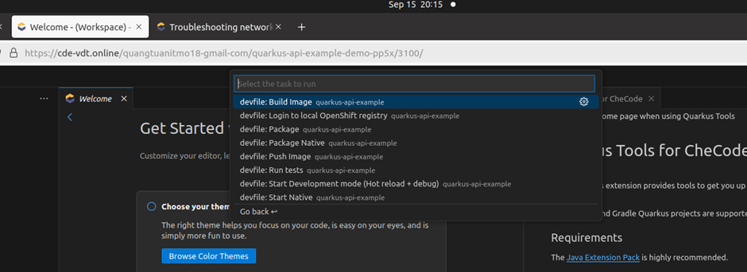
</div>

Run command to start development mode `start development mode`

<div align="center">
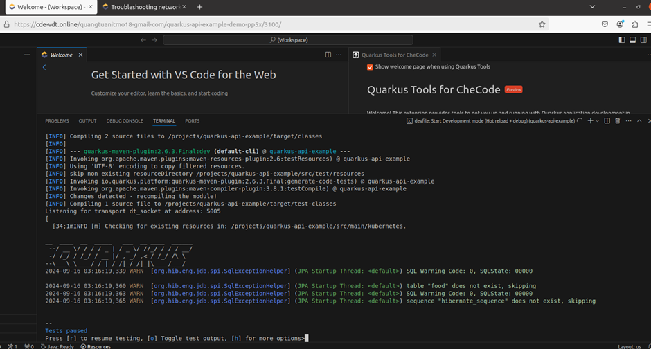

</div>

After the application is built, a link will appear to access it.

Verify the resources in the namespace of the newly created dev workspace:

<div align="center">
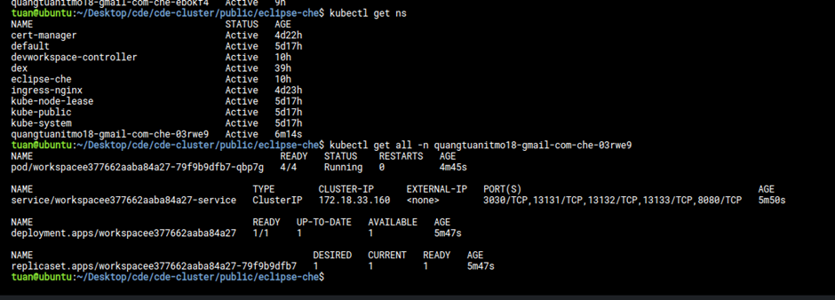
</div>

#### Additionally, install monitoring and measure performance.
