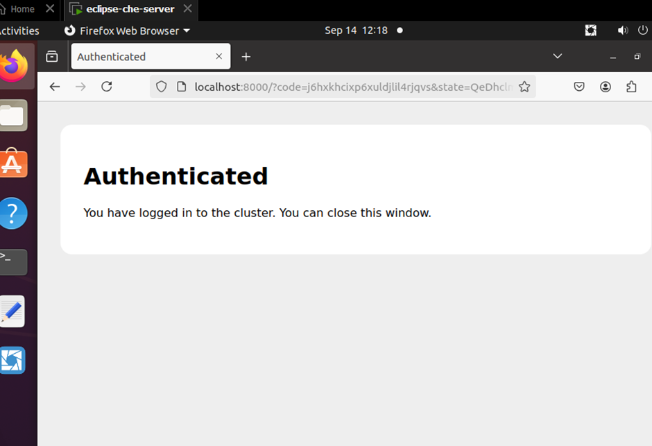

# Deploy CDE on K8S cluster public

Sau khi đã đi qua kiến trúc và các opensource để triển khai được CDE và đã thử nghiệm trên môi trường local, giờ tiến hành cài và thử nghiệm trên cụm k8s public

**Chuẩn bị**

1. 1 cụm k8s public với 1 master và 2 worker

<div align="center">
  
</div>

<br>

file kubeconfig

```yaml
apiVersion: v1
clusters:
  - cluster:
      certificate-authority-data: <<certificate-authority-data>>
      server: https://117.1.28.67:6443
    name: talent-2024-qjc85oferu
contexts:
  - context:
      cluster: talent-2024-qjc85oferu
      user: talent-2024-qjc85oferu-admin
    name: talent-2024-qjc85oferu-admin@talent-2024-qjc85oferu
current-context: talent-2024-qjc85oferu-admin@talent-2024-qjc85oferu
kind: Config
preferences: {}
users:
  - name: talent-2024-qjc85oferu-admin
    user:
      client-certificate-data: <<client-certificate-data>>
      client-key-data: <<client-key-data>>
```

2. 1 public domain
`cde-vdt.online`
<div align="center">
  
</div>

## 1. Installing Ingress-nginx controller

**_Installing with Helm_**

```
helm upgrade --install ingress-nginx ingress-nginx \
  --repo https://kubernetes.github.io/ingress-nginx \
  --namespace ingress-nginx --create-namespace
```

It will install the controller in the ingress-nginx namespace, creating that namespace if it doesn't already exist.

**_Installing with YAML manifest_**

```
kubectl apply -f https://raw.githubusercontent.com/kubernetes/ingress-nginx/controller-v1.11.2/deploy/static/provider/cloud/deploy.yaml
```

<br>

Sau khi đã cài xong check trên cụm thấy các resource trong namespace `ingress-nginx`, trong đó có service `ingress-nginx-controller` được expose ra ngoài với kiểu `loadbalancer` và có external-ip là `117.1.28.84`

<div align="center">
  
</div>
<br>

Tiếp đến cần trỏ domain vào external-ip `117.1.28.84` của ingress-nginx-controller
Tạo 2 DNS records cùng với `type` A và name là `@` và `*`. Type `@` để `cde-vdt.online` có thể trỏ về được ip `117.1.28.84` và type `*` để các subdomain dạng `*.cde-vdt.online` cũng trỏ về được ip `117.1.28.84`

<div align="center">
  
</div>

<div align="center">
  
</div>

## 2. Installing cert-manager

The default static configuration can be installed as follows:

```
kubectl apply -f https://github.com/cert-manager/cert-manager/releases/download/v1.15.3/cert-manager.yaml
```

<div align="center">
  
</div>

<br>

Sau khi đã cài xong `cert-manager` tiếp đến cần tạo `Issuer` hoặc `ClusterIssuer` là crd của Cert-Manager để tạo và quản lý các chứng chỉ. Cần tạo một `Issuer` hoặc `ClusterIssuer` cho [Let's Encrypt](https://cert-manager.io/docs/tutorials/acme/nginx-ingress/). Có hai loại Issuer cho Let's Encrypt: staging (test) và production. Dưới đây là file YAML để tạo một ClusterIssuer dùng Let's Encrypt staging và production.

`ClusterIssuer` có tên là `letsencrypt-staging` và `letsencrypt-prod`

```yaml
apiVersion: cert-manager.io/v1
kind: ClusterIssuer
metadata:
  name: letsencrypt-staging
spec:
  acme:
    # Let's Encrypt ACME server
    server: https://acme-staging-v02.api.letsencrypt.org/directory
    email: quangtuanitmo18@gmail.com
    privateKeySecretRef:
      name: letsencrypt-prod
    solvers:
      - http01:
          ingress:
            class: nginx
```

```yaml
apiVersion: cert-manager.io/v1
kind: ClusterIssuer
metadata:
  name: letsencrypt-prod
spec:
  acme:
    # Let's Encrypt ACME server
    server: https://acme-v02.api.letsencrypt.org/directory
    email: quangtuanitmo18@gmail.com
    privateKeySecretRef:
      name: letsencrypt-prod
    solvers:
      - http01:
          ingress:
            class: nginx
```

Sau khi apply 2 file yaml trên lấy ra thu được

<div align="center">
  
</div>

<br>

Sau khi đã có clusterissuer như trên, từ giờ chỉ cần thêm spec `tls` vào cấu hình ingress là sẽ được cấp cert để sử dụng https

ví dụ triển khai ingress cho 1 service `nginx`

```yaml
apiVersion: networking.k8s.io/v1
kind: Ingress
metadata:
  name: nginx-ingress
  annotations:
    nginx.ingress.kubernetes.io/rewrite-target: /
    cert-manager.io/cluster-issuer: "letsencrypt-prod"
    nginx.ingress.kubernetes.io/force-ssl-redirect: "true"
spec:
  ingressClassName: nginx # Sử dụng Ingress class của Nginx
  tls:
    - hosts:
        - cde-vdt.online # Subdomain của bạn
      secretName: cde-vdt-online-tls # Secret sẽ chứa chứng chỉ SSL
  rules:
    - host: cde-vdt.online
      http:
        paths:
          - path: /
            pathType: Prefix
            backend:
              service:
                name: nginx-service
                port:
                  number: 80
```

Sau khi cấu hình xong, Cert-Manager sẽ tự động yêu cầu chứng chỉ từ Let's Encrypt.có thể kiểm tra quá trình yêu cầu chứng chỉ bằng lệnh:

`kubectl describe certificate cde-vdt-online-tls`

Truy cập đường link `cde-vdt.online` từ browser và thấy đã được cấp chứng chỉ để chạy https

<div align="center">
  
</div>

## 3. Installing DEX oidc

This allows us to authenticate to the Kubernetes API server using another identity provider. Using dex allows for multiple, plugable, identity backends.

I started using dex because it allowed me to add LDAP to Kubernetes, but for this demo I'll use GitHub as the AuthN of choice.

If you don't want to extend the Kubernetes API AuthN - but still want AuthN at the ingress, consider using something a bit more basic "on-top" like: https://github.com/oauth2-proxy/oauth2-proxy. It could be layered via ingress annotations. The key difference is authenticating to applications on the cluster or authenticating to the Kubernetes API server.

Using GitHub as the OIDC identity provider, means I can create Kubernetes RBAC (AuthZ) about GitHub OIDC claims. "Anyone" I grant access to, with a valid GitHub login and a correctly configured kubectl config could access my cluster. The key point is that it's only who: "I grant access to."

It's important to understand the flow:

> staticClient (kube-login or UI) -> dex (oidc) -> GitHub (oidc) -> dex (oidc) -> refreshed credentials (to API / staticClient)

### 3.1 Setup an OAuth app in Github

`GitHub > Settings > Developer Settings > OAuth Apps > Register a new application`

ở đây để homepage url là `https:dex3.cde-vdt.online`

<div align="center">
  
</div>

<div align="center">
  
</div>

Lấy và lưu lại clientID và Secret để sau này dùng

### 3.2 Setup Kubernetes API servers

Adding these flags, assuming no typos, should have no impact to the existing behavior of your API server. We're adding AuthN methods and not removing anything. It can be done before we actually have oidc setup completely.

We need to instruct the API server to support our OIDC source. Assuming you're using Let's Encrypt for the dex (OIDC) HTTPS endpoint, let's create the CA cert. We do this so the API server can leverage our OIDC configuration and "trust" LetsEncrypt as the issuing CA.

To update the API server, modify the static manifest (/etc/kubernetes/manifests/kube-apiserver.yaml) which kubelet automatically reads when changed. Note that any typo here could prevent the API server from starting and it might be worth backing up the file (or rebuilding).

```
# ssh into the control plane node

# copy the letsencrypt cert stack to the node
curl https://letsencrypt.org/certs/isrgrootx1.pem.txt > isrgrootx1.pem.txt
curl https://letsencrypt.org/certs/lets-encrypt-x3-cross-signed.pem.txt > lets-encrypt-x3-cross-signed.pem.txt
cat isrgrootx1.pem.txt lets-encrypt-x3-cross-signed.pem.txt > letsencrypt.pem

# move cert to kubernetes pki
cp letsencrypt.pem /etc/kubernetes/pki/letsencrypt.pem
```

This can be setup without impact to existing auth / access. The flags configure the Kubernetes API server for OIDC but since we don't use OIDC for AuthN - there is no impact.

<div align="center">
  
</div>

```
# update the API server configuration
vi /etc/kubernetes/manifests/kube-apiserver.yaml

# insert / copy the following to the bottom of `spec.containers.command:`

    - --oidc-ca-file=/etc/kubernetes/pki/letsencrypt.pem
    - --oidc-client-id=cde-vdt
    - --oidc-groups-claim=groups
    - --oidc-issuer-url=https://dex3.cde-vdt.online
    - --oidc-username-claim=email

# confirm the API server is running (it should exist and have been recently restarted)
sudo crictl ps | grep api

# return to your local shell
exit
```

### 3.3 Install DEX

Cài dex thông qua helm

Chạy lệnh để add repo dex về helm `helm repo add dex https://charts.dexidp.io`

sau đó cài dex với helm thông qua file values sau:

```yaml
https:
  enabled: true

ingress:
  enabled: true
  className: nginx
  annotations:
    cert-manager.io/cluster-issuer: "letsencrypt-prod"
    nginx.ingress.kubernetes.io/ssl-redirect: "false"
    nginx.ingress.kubernetes.io/force-ssl-redirect: "false"
  hosts:
    - host: dex3.cde-vdt.online # Thay thế example.com bằng domain của bạn
      paths:
        - path: /
          pathType: ImplementationSpecific
  tls:
    - secretName: dex-cde-vdt-tls
      hosts:
        - dex3.cde-vdt.online # Thay thế example.com bằng domain của bạn

volumes:
  - name: tls
    csi:
      driver: csi.cert-manager.io
      readOnly: true
      volumeAttributes:
        "csi.cert-manager.io/issuer-name": "letsencrypt-prod"
        "csi.cert-manager.io/issuer-kind": "ClusterIssuer"
        "csi.cert-manager.io/dns-names": "dex3.cde-vdt.online" # Thay thế example.com
        "csi.cert-manager.io/certificate-file": "tls.crt"
        "csi.cert-manager.io/privatekey-file": "tls.key"

volumeMounts:
  - name: tls
    mountPath: /etc/crt
    readOnly: true

config:
  enablePasswordDB: false
  storage:
    type: memory
  web:
    https: 0.0.0.0:5554
    tlsCert: /etc/crt/tls.crt
    tlsKey: /etc/crt/tls.key
  issuer: https://dex3.cde-vdt.online # Thay thế example.com
  connectors:
    - type: github
      id: github
      name: GitHub
      config:
        clientID: Ov23lioq55LWBLTpgl0V # Đặt giá trị của CLIENT_ID
        clientSecret: 3e7824f9864cfa6ae6239e48630fa0c0fee7fe2b # Đặt giá trị của CLIENT_SECRET
        redirectURI: https://dex3.cde-vdt.online/callback # Thay thế example.com
  staticClients:
    - id: cde-vdt
      redirectURIs:
        - http://localhost:8000
        - http://localhost:18000
        - http://127.0.0.1:5555/callback
        - https://cde-vdt.online/oauth/callback
      name: Testing OIDC
      secret: ZXhhbXBsZS1hRANDOMSTRINGcHAtc2VjcmV0

# Ingress annotations
extraIngressAnnotations:
  nginx.ingress.kubernetes.io/ssl-passthrough: "true"
```

chạy lênh `helm install dex dex/dex --values values.yaml -n dex` để cài dex lên cụm của mình

sau khi đã cài dex xong truy cập vào link `https://dex3.cde-vdt.online/.well-known/openid-configuration` để xem lại config

<div align="center">
  
</div>

### 3.4 Test with kubelogin

Putting it all together, use [kubelogin](https://github.com/int128/kubelogin), a kubectl plugin for Kubernetes OpenID Connect authentication (kubectl oidc-login).

Installing the plugin with `brew` automatically adds it to my path and I can leverage it by updating my kubeconfig.

```
# install kubelogin
brew install int128/kubelogin/kubelogin
```

Create a KUBECONFIG user named oidc ("set-credentials") with our config. This does not overwrite your current user and you can switch between users for testing.

```
# create a user named "oidc"
kubectl config set-credentials oidc \
  --exec-api-version=client.authentication.k8s.io/v1beta1 \
  --exec-command=kubectl \
  --exec-arg=oidc-login \
  --exec-arg=get-token \
  --exec-arg=--oidc-issuer-url="https://dex3.cde-vdt.online" \
  --exec-arg=--oidc-client-id="cde" \
  --exec-arg=--oidc-extra-scope="email" \
  --exec-arg=--oidc-client-secret="ZXhhbXBsZS1hRANDOMSTRINGcHAtc2VjcmV0"
```

now have 2 users in your KUBECONFIG ("oidc" and "talent-2024-qjc85oferu-admin"). Let's switch to our user for testing:

```
# switch to the oidc user
kubectl config set-context --current --user=oidc

# should open a browser to login
kuebctl get pods -A
error: You must be logged in to the server (Unauthorized)
```

As expected, since we don't have any permissions. Let's give us some:

```
# switch back to working cluster admin
kubectl config set-context --current --user=talent-2024-qjc85oferu-admin

# create cluster role binding for testing using my GitHub email as the user scope
kubectl create clusterrolebinding oidc-cluster-admin --clusterrole=cluster-admin --user='quangtuanitmo18@gmail.com'
```

Test again, sau khi user `oidc` đã có quyền thực thi rồi:

```
# use the oidc user
kubectl config set-context --current --user=oidc

# get all pods
kubectl get pods -A
```

Nó sẽ hiện lên màn hình xác thực với github do mình dã dùng github làm connector, sau khi xác thực trên github thì chuyển hướng về `dex` mà đã cài trên cụm để grant permission của user

<div align="center">
  
</div>

<div align="center">
  
</div>

sau khi user đã được authenticated thì get pod ra sẽ được kết quả như sau

<div align="center">
  
</div>

### 3. Installing Eclipse-che

Thực hiện cài eclipse-che bằng chectl, do vậy trước tiên cần cài chectl trước đã

**_Prerequisites_**

- The directory /usr/local/bin is in the user $PATH.

- The sudo command is configured for the current user.

- No old or undesired versions of chectl present on the system.

**_Procedure_**

1.  Run the following command in the terminal (this downloads and executes the install.sh script):

    ```
    $ bash <(curl -sL https://che-incubator.github.io/chectl/install.sh)
    ```

2.  Run the following command to verify that the chectl tool is available at `/usr/local/bin/chectl`:

    ```
    $ which chectl
    /usr/local/bin/chectl
    ```

3.  Run the following command to verify that the version of chectl that is the expected one.
    ```
    $ chectl --version
    ```

Tiếp đến cài eclipse-che bằng chectl với file `che-cluster-patch.yaml dưới đây`

```yaml
spec:
  networking:
    auth:
      identityProviderURL: "https://dex3.cde-vdt.online"
      oAuthClientName: "cde-vdt"
      oAuthSecret: "ZXhhbXBsZS1hRANDOMSTRINGcHAtc2VjcmV0"
      oAuthScope: "openid email profile"
      gateway:
        deployment:
          containers:
            - env:
                - name: OAUTH2_PROXY_INSECURE_OIDC_ALLOW_UNVERIFIED_EMAIL
                  value: "true"
              name: oauth-proxy
    tlsSecretName: "che-tls"
  components:
    cheServer:
      extraProperties:
        CHE_OIDC_AUTH__SERVER__URL: "https://dex3.cde-vdt.online"
        CHE_OIDC_USERNAME__CLAIM: email
        CHE_OIDC_GROUPS__CLAIM: groups
```

chạy lệnh để deploy eclips-che (chi tiết xem [tại đây](https://github.com/che-incubator/chectl))

```
chectl server:deploy \
       --platform=k8s \
       --che-operator-cr-patch-yaml=che-cluster-patch.yaml \
       --skip-cert-manager \
       --domain=cde-vdt.online
```

Sau khi deploy che lên xong chạy lệnh `chectl dashboard:open` để bật dashboard của eclipse-che lên

sau đó nó sẽ redirect sang dex để tiến hành grant permission

<div align="center">
  
</div>

sau khi grant permission xong thì redirect ngược lại dashboard của eclipse-che

<div align="center">
  
</div>

<br>

Giờ tiền hành tạo thử dev workspace, tạo dev workspace từ repo github `https://github.com/quangtuanitmo18/quarkus-api-example`
trong đó có sẵn devfile để tạo dev workspace

Devfile định nghĩa 3 thành phần chính trong workspace:

**components**

1. tools (container):

   - image: Sử dụng image quay.io/devfile/universal-developer-image:ubi8-latest, là một môi trường phát triển phổ biến.
   - env: Biến môi trường cho container này:
     QUARKUS_HTTP_HOST: Đặt giá trị 0.0.0.0 để Quarkus lắng nghe các kết nối trên tất cả các giao diện mạng.
   - endpoints:
     - Cổng debug (5005/tcp) dùng để debug Quarkus. Cổng này không được public.
     - Cổng list-all-food (8080/http), là cổng public cho ứng dụng web Quarkus, sẽ phục vụ API tại đường dẫn /food.
   - memoryLimit: Giới hạn bộ nhớ cho container là 6G.

   - mountSources: Gắn mã nguồn của dự án vào container này.

2. postgresql (container):
   - image: Sử dụng image PostgreSQL từ quay.io/centos7/postgresql-13-centos7.
   - env: Các biến môi trường cấu hình cho PostgreSQL:
     POSTGRESQL_USER, POSTGRESQL_PASSWORD, POSTGRESQL_DATABASE: Đặt các thông tin đăng nhập và tên cơ sở dữ liệu.
   - PGDATA: Đặt đường dẫn lưu trữ dữ liệu PostgreSQL là /tmp/pgdata.
3. ubi-minimal (container):

   - image: Sử dụng image registry.access.redhat.com/ubi8/ubi-minimal, là một image tối thiểu từ Red Hat.
   - command và args: Container này sẽ chạy lệnh tail -f /dev/null để duy trì trạng thái hoạt động mà không làm gì khác.
   - memoryLimit: Giới hạn bộ nhớ là 64M.

   - mountSources: Gắn mã nguồn vào container này. 5.

**commands**

Devfile định nghĩa một số lệnh để thực hiện các tác vụ khác nhau:

1. package
   - Lệnh này thực hiện quá trình build ứng dụng Quarkus mà không chạy các bài test (./mvnw clean package -DskipTests=true).
   - Đây là lệnh build mặc định cho workspace (isDefault: true).
2. runtests
   - Lệnh này chạy các bài kiểm thử của dự án (./mvnw test).
3. packagenative
   - Build ứng dụng Quarkus ở chế độ native image (./mvnw package -Dnative) với giới hạn bộ nhớ 3G.
4. buildimage
   - Build image Docker cho ứng dụng sử dụng Podman (podman build).
5. loginlocalregistry
   - Đăng nhập vào registry của OpenShift nội bộ bằng Podman (podman login).
6. pushimage
   - Push image đã build lên registry của OpenShift (podman push).
7. startdev
   - Bắt đầu chế độ phát triển của Quarkus, bao gồm hỗ trợ hot reload và debug (./mvnw compile quarkus:dev).
   - Đây là lệnh mặc định khi chạy ứng dụng (isDefault: true).
8. startnative
   - Chạy phiên bản native của ứng dụng (./quarkus-api-example-1.0.0-SNAPSHOT-runner) trong container ubi-minimal.

```yaml
schemaVersion: 2.1.0
metadata:
  generateName: quarkus-api-example-demo
attributes:
  controller.devfile.io/storage-type: ephemeral
components:
  - name: tools
    container:
      image: quay.io/devfile/universal-developer-image:ubi8-latest
      env:
        - name: QUARKUS_HTTP_HOST
          value: 0.0.0.0
      endpoints:
        - exposure: none
          name: debug
          protocol: tcp
          targetPort: 5005
        - exposure: public
          name: list-all-food
          protocol: http
          targetPort: 8080
          path: /food
      memoryLimit: 6G
      mountSources: true

  - name: postgresql
    container:
      image: "quay.io/centos7/postgresql-13-centos7@sha256:994f5c622e2913bda1c4a7fa3b0c7e7f75e7caa3ac66ff1ed70ccfe65c40dd75"
      env:
        - name: POSTGRESQL_USER
          value: user
        - name: POSTGRESQL_PASSWORD
          value: password
        - name: POSTGRESQL_DATABASE
          value: food_db
        - name: PGDATA
          value: /tmp/pgdata

  - name: ubi-minimal
    container:
      image: registry.access.redhat.com/ubi8/ubi-minimal
      command: ["tail"]
      args: ["-f", "/dev/null"]
      memoryLimit: 64M
      mountSources: true
commands:
  - id: package
    exec:
      label: "Package"
      component: tools
      workingDir: ${PROJECT_SOURCE}
      commandLine: "./mvnw clean package -DskipTests=true -Dquarkus.profile=staging"
      group:
        kind: build
        isDefault: true
  - id: runtests
    exec:
      label: "Run tests"
      component: tools
      workingDir: ${PROJECT_SOURCE}
      commandLine: "./mvnw test"
      group:
        kind: test
  - id: packagenative
    exec:
      label: "Package Native"
      component: tools
      workingDir: ${PROJECT_SOURCE}
      commandLine: "./mvnw package -Dnative -Dmaven.test.skip -Dquarkus.native.native-image-xmx=3G  -Dquarkus.profile=staging"
      group:
        kind: build
  - id: buildimage
    exec:
      label: "Build Image"
      component: tools
      workingDir: ${PROJECT_SOURCE}
      commandLine: "podman build -f src/main/docker/Dockerfile.jvm -t image-registry.openshift-image-registry.svc:5000/openshift/quarkus-api-example ."
      group:
        kind: build
  - id: loginlocalregistry
    exec:
      label: "Login to local OpenShift registry"
      component: tools
      workingDir: ${PROJECT_SOURCE}
      commandLine: "podman login --tls-verify=false -u kubeadmin -p $(oc whoami -t) image-registry.openshift-image-registry.svc:5000"
      group:
        kind: run
  - id: pushimage
    exec:
      label: "Push Image"
      component: tools
      workingDir: ${PROJECT_SOURCE}
      commandLine: "podman push --tls-verify=false image-registry.openshift-image-registry.svc:5000/openshift/quarkus-api-example"
      group:
        kind: build
  - id: startdev
    exec:
      label: "Start Development mode (Hot reload + debug)"
      component: tools
      workingDir: ${PROJECT_SOURCE}
      commandLine: "./mvnw compile quarkus:dev"
      group:
        kind: run
        isDefault: true
  - id: startnative
    exec:
      label: "Start Native"
      component: ubi-minimal
      workingDir: ${PROJECT_SOURCE}/target
      commandLine: "./quarkus-api-example-1.0.0-SNAPSHOT-runner"
      group:
        kind: run
```

Có thể tạo dev workspace trên dashboard của eclipse-che hoặc truy cập vào đường link `https://cde-vdt.online/#https://github.com/quangtuanitmo18/quarkus-api-example` thì dev workspace sẽ tự động được tạo

đường link trên sẽ có cấu trúc như sau

<div align="center">
  
</div>

sau đó quá trình tạo dev workpsace sẽ diễn ra

<div align="center">
  
</div>

sau khi tạo xong ta đã có một môi trường code trên browser

<div align="center">
  
</div>

check lại các command đã khai báo ở devfile

<div align="center">
  
</div>

chạy command `start development mode lên`

<div align="center">


</div>

Sau khi ứng dụng đã được build xong thì hiện lên 1 đường link để truy cập vào

Kiểm tra lại các resrouce trên namespace của dev workspace mới được tạo

<div align="center">

</div>

#### cài thêm monitoring rồi đo performance
