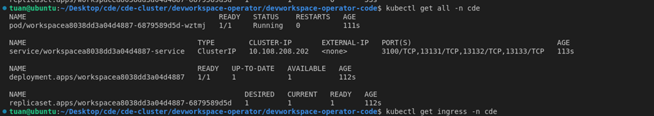

# Devworkspace operator

## 1. Introduction to DevWorkspace operator

The DevWorkspace Operator is an operator for Kubernetes that manages the lifecycle of developer workspaces. It is primarily used in cloud-native development environments to provide configurable and reproducible development environments. The operator allows users to create, manage, and scale developer workspaces as Kubernetes resources.

Here are some key aspects of the DevWorkspace Operator:

1. Developer Workspaces as Kubernetes Resources:
   - Developer workspaces are represented as custom Kubernetes resources, meaning they are defined using Custom Resource Definitions (CRDs).
   - These workspaces can include an IDE (e.g., Eclipse Theia or VSCode), a set of tools, and project files that are run as containers in a Kubernetes cluster.
2. Configuration through DevWorkspace Custom Resource:
   - Developers or administrators can define a DevWorkspace resource, specifying the environment configuration (such as IDE, tools, runtime images) needed for the workspace.
   - The operator takes care of deploying and managing these resources in a Kubernetes namespace.
3. Automatic Management:
   - The DevWorkspace Operator automates tasks such as workspace creation, persistence, scaling, and deletion.
   - It ensures that each workspace is isolated, persistent (across sessions), and ready to be accessed remotely.
4. Integration with Cloud-Native IDEs:
   - The operator integrates with cloud-native IDEs like Eclipse Che, allowing developers to have browser-based, cloud-hosted development environments.
   - Workspaces are built on containerized images, so they are portable and can be reproduced consistently across environments.
5. Common Use Cases:
   - Teams can share consistent development environments.
   - Quickly spin up workspaces for different projects, eliminating "it works on my machine" problems.
   - Integrates well in CI/CD pipelines where automated testing, building, or even coding can be done in managed, ephemeral environments.
6. Customization and Extensibility:
   - DevWorkspace allows developers to customize their workspace definitions, adding necessary tools, configuring IDE settings, and including relevant projects or codebases.
   - The operator ensures the consistency of the workspaces as defined by these configurations, managing storage (for persistence) and resource allocation.
7. Benefits:
   - Isolation: Each developer gets an isolated environment running on Kubernetes, reducing resource conflicts.
   - Scalability: Workspaces can be scaled up or down easily based on the resources in the cluster.
   - Collaboration: Easy to share, collaborate, and maintain reproducible environments.

## 2. Configuration

### 2.1 Global configuration for the DevWorkspace Operator

The DevWorkspace Operator installs the DevWorkspaceOperatorConfig custom resource (short name: `dwoc`). To configure global behavior of the DevWorkspace Operator, create a DevWorkspaceOperatorConfig named `devworkspace-operator-config` in the same namespace where the operator is deployed:

```yaml
apiVersion: controller.devfile.io/v1alpha1
kind: DevWorkspaceOperatorConfig
metadata:
  name: devworkspace-operator-config
  namespace: $OPERATOR_INSTALL_NAMESPACE
config:
  # Configuration fields
```

To apply a configuration to specific workspaces instead of globally, an existing DevWorkspaceOperatorConfig can be referenced in a DevWorkspace's attributes:

```yaml
apiVersion: workspace.devfile.io/v1alpha2
kind: DevWorkspace
metadata:
  name: my-devworkspace
spec:
  template:
    attributes:
      controller.devfile.io/devworkspace-config:
        name: <name of DevWorkspaceOperatorConfig CR>
        namespace: <namespace of DevWorkspaceOperatorConfig CR>
```

Configuration specified as above will be merged into the default global configuration, overriding any values present.

To see all all configuration options, see `kubectl explain dwoc.config`, `kubectl explain dwoc.config.workspace`, etc.

### 2.2 Additional configuration

DevWorkspaces can be further configured through DevWorkspace attributes and Kubernetes labels/annotations. For a list of all options available, see [additional documentation](docs/additional-configuration.adoc).

### 2.3 Restricted Access

The `controller.devfile.io/restricted-access` annotation specifies that a DevWorkspace needs additional access control (in addition to RBAC). When a DevWorkspace is created with the `controller.devfile.io/restricted-access` annotation set to `true`, the webhook server will guarantee

- Only the DevWorkspace Operator ServiceAccount or DevWorkspace creator can modify important fields in the DevWorkspace
- Only the DevWorkspace creator can create `pods/exec` into devworkspace-related containers.

This annotation should be used when a DevWorkspace is expected to contain sensitive information that should be protect above the protection provided by standard RBAC rules (e.g. if the DevWorkspace will store the user's OpenShift token in-memory).

Example:

```yaml
metadata:
  annotations:
    controller.devfile.io/restricted-access: true
```

## 3. Deploying DevWorkspace Operator

### 3.1 Prerequisites

- go 1.16 or later
- git
- sed
- jq
- yq (python-yq from https://github.com/kislyuk/yq#installation, other distributions may not work)
- skopeo (if building the OLM catalogsource)
- podman or docker

Note: kustomize `v4.0.5` is required for most tasks. It is downloaded automatically to the `.kustomize` folder in this repo when required. This downloaded version is used regardless of whether or not kustomize is already installed on the system.

### 3.2 Running the controller in a cluster

#### 3.2.1 With yaml resources

When installing on Kubernetes clusters, the DevWorkspace Operator requires the [cert-manager](https://cert-manager.io) operator in order to properly serve webhooks. To install the latest version of cert-manager in a cluster, the Makefile rule `install_cert_manager` can be used. The minimum version of cert-manager is `v1.0.4`.

The controller can be deployed to a cluster provided you are logged in with cluster-admin credentials:

```bash
export DWO_IMG=quay.io/devfile/devworkspace-controller:next
make install
```

By default, the controller will expose workspace servers without any authentication; this is not advisable for public clusters, as any user could access the created workspace via URL.

See below for all environment variables used in the makefile.

> Note: The operator requires internet access from containers to work. By default, `crc setup` may not provision this, so it's necessary to configure DNS for Docker:
>
> ```
> # /etc/docker/daemon.json
> {
>   "dns": ["192.168.0.1"]
> }
> ```

#### 3.2.2 With Operator Lifecycle Manager (OLM)

DevWorkspace Operator has bundle and index images which enable installation via OLM. To enable installing the DevWorkspace Operator through OLM, it may be necessary to create a CatalogSource in the cluster for this index:

```yaml
apiVersion: operators.coreos.com/v1alpha1
kind: CatalogSource
metadata:
  name: devworkspace-operator-catalog
  namespace: openshift-marketplace # Namespace for catalogsource, not operator itself
spec:
  sourceType: grpc
  image: quay.io/devfile/devworkspace-operator-index:next
  publisher: Red Hat
  displayName: DevWorkspace Operator Catalog
  updateStrategy:
    registryPoll:
      interval: 5m
```

Two index images are available for installing the DevWorkspace Operator:

- `quay.io/devfile/devworkspace-operator-index:release` - multi-version catalog with all DevWorkspace Operator releases
- `quay.io/devfile/devworkspace-operator-index:next` - single-version catalog that will deploy the latest commit in the `main` branch

Both index images allow automatic updates (to either the latest release or latest commit in main).

After OLM finishes processing the created CatalogSource, DWO should appear on the Operators page in the OpenShift Console.

In order to build a custom bundle, the following environment variables should be set:
| variable | purpose | default value |
|---|---|---|
| `DWO_BUNDLE_IMG` | Image used for Operator bundle image | `quay.io/devfile/devworkspace-operator-bundle:next` |
| `DWO_INDEX_IMG` | Image used for Operator index image | `quay.io/devfile/devworkspace-operator-index:next` |
| `DEFAULT_DWO_IMG` | Image used for controller when generating defaults | `quay.io/devfile/devworkspace-controller:next` |

To build the index image and register its catalogsource to the cluster, run

```
make generate_olm_bundle_yaml build_bundle_and_index register_catalogsource
```

Note that setting `DEFAULT_DWO_IMG` while generating sources will result in local changes to the repo which should be `git restored` before committing. This can also be done by unsetting the `DEFAULT_DWO_IMG` env var and re-running `make generate_olm_bundle_yaml`

## 4. Development

The repository contains a Makefile; building and deploying can be configured via the environment variables

| variable                   | purpose                                                                                                                                | default value                                  |
| -------------------------- | -------------------------------------------------------------------------------------------------------------------------------------- | ---------------------------------------------- |
| `DWO_IMG`                  | Image used for controller                                                                                                              | `quay.io/devfile/devworkspace-controller:next` |
| `DEFAULT_DWO_IMG`          | Image used for controller when generating default deployment templates. Can be used to override the controller image in the OLM bundle | `quay.io/devfile/devworkspace-controller:next` |
| `NAMESPACE`                | Namespace to use for deploying controller                                                                                              | `devworkspace-controller`                      |
| `ROUTING_SUFFIX`           | Cluster routing suffix (e.g. `$(minikube ip).nip.io`, `apps-crc.testing`). Required for Kubernetes                                     | `192.168.99.100.nip.io`                        |
| `PULL_POLICY`              | Image pull policy for controller                                                                                                       | `Always`                                       |
| `DEVWORKSPACE_API_VERSION` | Branch or tag of the github.com/devfile/api to depend on                                                                               | `v1alpha1`                                     |

Some of the rules supported by the makefile:

| rule                 | purpose                                                                            |
| -------------------- | ---------------------------------------------------------------------------------- |
| docker               | build and push docker image                                                        |
| install              | install controller to cluster                                                      |
| restart              | restart cluster controller deployment                                              |
| install_cert_manager | installs the cert-manager to the cluster (only required for Kubernetes)            |
| uninstall            | delete controller namespace `devworkspace-controller` and remove CRDs from cluster |
| help                 | print all rules and variables                                                      |

To see all rules supported by the makefile, run `make help`

### 4.1 Test run controller

1. Take a look samples devworkspace configuration in `./samples` folder.
2. Apply any of them by executing `kubectl apply -f ./samples/code-latest.yaml -n <namespace>`
3. As soon as devworkspace is started you're able to get IDE url by executing `kubectl get devworkspace -n <namespace>`

**_Test run controller on `Kind`_**
Tạo 1 ns `cde` để triển khai dw lên sau đó apply câu lệnh
`kubectl apply -f ./samples/code-latest.yaml -n cde`

với `code-latest.yaml` như sau:

```yaml
kind: DevWorkspace
apiVersion: workspace.devfile.io/v1alpha2
metadata:
  name: code-latest
spec:
  started: true
  template:
    projects:
      - name: web-nodejs-sample
        git:
          remotes:
            origin: "https://github.com/che-samples/web-nodejs-sample.git"
    components:
      - name: dev
        container:
          image: quay.io/devfile/universal-developer-image:latest
          memoryLimit: 512Mi
          memoryRequest: 256Mi
          cpuRequest: 1000m
    commands:
      - id: say-hello
        exec:
          component: dev
          commandLine: echo "Hello from $(pwd)"
          workingDir: ${PROJECT_SOURCE}/app
  contributions:
    - name: che-code
      uri: https://eclipse-che.github.io/che-plugin-registry/main/v3/plugins/che-incubator/che-code/latest/devfile.yaml
      components:
        - name: che-code-runtime-description
          container:
            env:
              - name: CODE_HOST
                value: 0.0.0.0
```

Sau khi apply file trên thì sẽ được các resource như sau:

<div align="center">
  
</div>

Với `Kind` thì cluster chạy trong container, inspect ra thì thấy cụm kind sẽ có ip là `172.18.0.3`

<div align="center">
  
</div>
Có ip là 172.18.0.3 là của cụm kind, tức là giờ ingress của dw cần có address như này

Lấy ingress ra

<div align="center">
  
</div>

Truy cập vào host trên của ingress sẽ vào được dw của ta

<div align="center">
  
</div>

Build code và run code lên sẽ được như sau

<div align="center">
  
</div>

### 4.2 Run controller locally

```bash
export NAMESPACE="devworkspace-controller"
make install
# Wait for webhook server to start
kubectl rollout status deployment devworkspace-controller-manager -n $NAMESPACE --timeout 90s
kubectl rollout status deployment devworkspace-webhook-server -n $NAMESPACE --timeout 90s
# Scale on-cluster deployment to zero to avoid conflict with locally-running instance
oc patch deployment/devworkspace-controller-manager --patch "{\"spec\":{\"replicas\":0}}" -n $NAMESPACE
make run
```

### 4.3 Run controller locally and debug

Debugging the controller depends on [delve](https://github.com/go-delve/delve) being installed (`go install github.com/go-delve/delve/cmd/dlv@latest`). Note that `$GOPATH/bin` or `$GOBIN` must be added to `$PATH` in order for `make debug` to run correctly.

```bash
make install
# Wait for webhook server to start
kubectl rollout status deployment devworkspace-controller-manager -n $NAMESPACE --timeout 90s
kubectl rollout status deployment devworkspace-webhook-server -n $NAMESPACE --timeout 90s
oc patch deployment/devworkspace-controller-manager --patch "{\"spec\":{\"replicas\":0}}"
# Scale on-cluster deployment to zero to avoid conflict with locally-running instance
make debug
```

### 4.4 Run webhook server locally and debug

Debugging the webhook server depends on `telepresence` being installed (`https://www.telepresence.io/docs/latest/install/`). Teleprescence works by redirecting traffic going from the webhook-server in the cluster to the local webhook-server you will be running on your computer.

```bash
make debug-webhook-server
```

when you are done debugging you have to manually uninstall the telepresence agent

```bash
make disconnect-debug-webhook-server
```

### 4.5 Updating devfile API

[devfile API](https://github.com/devfile/api) is the Kube-native API for cloud development workspaces specification and the core dependency of the devworkspace-operator that should be regularly updated to the latest version. In order to do the update:

1. update `DEVWORKSPACE_API_VERSION` variable in the `Makefile` and `build/scripts/generate_deployment.sh`. The variable should correspond to the commit SHA from the [devfile API](https://github.com/devfile/api) repository
2. run the following scripts and the open pull request

```bash
make update_devworkspace_api update_devworkspace_crds # first commit
make generate_all # second commit
```

Example of the devfile API update [PR](https://github.com/devfile/devworkspace-operator/pull/797)

### 4.6 Controller configuration

Controller behavior can be configured using the `DevWorkspaceOperatorConfig` custom resource (`dwoc` for short). To configure the controller, create a `DevWorkspaceOperatorConfig` named `devworkspace-operator-config` in the same namespace as the controller. If using the Makefile to deploy the DevWorkspaceOperator, a pre-filled config is created automatically (see `deploy/default-config.yaml`).

Configuration settings in the `DevWorkspaceOperatorConfig` override default values found in [pkg/config](https://github.com/devfile/devworkspace-operator/tree/main/pkg/config). The only required configuration setting is `.routing.clusterHostSuffix`, which is required when running on Kubernetes.

To see documentation on configuration settings, including default values, use `kubectl explain` or `oc explain` -- e.g. `kubectl explain dwoc.config.routing.clusterHostSuffix`

### 4.7 Remove controller from your K8s/OS Cluster

To uninstall the controller and associated CRDs, use the Makefile uninstall rule:

```bash
make uninstall
```

This will delete all custom resource definitions created for the controller, as well as the `devworkspace-controller` namespace.
