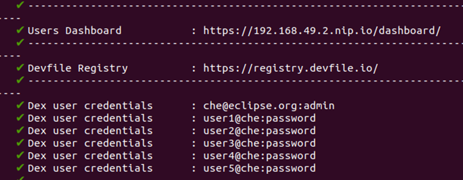
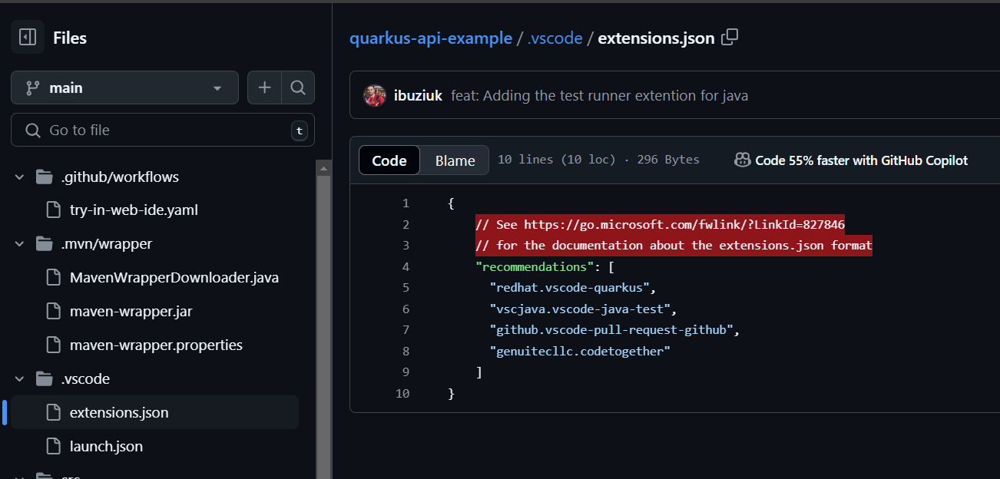

# Eclipse che

## 1. Introduction to Eclipse che

- A centralized developer environment running on Kubernetes or OpenShift.

- A multi-container workspace for each developer with the ability to replicate with a single click using Eclipse Che factories.

- Pre-built stacks with the ability to create custom stacks for any language or runtime.

- An enterprise integration using OpenShift OAuth or Dex.

- Browser-based IDEs; integration with Microsoft Visual Studio Code - Open Source and others such as JetBrains IntelliJ IDEA Community Edition.

- Support of tools protocols, such as the Language Server Protocol or Debug Adapter Protocol.

- A plugin mechanism compatible with Visual Studio Code extensions.

- A software development kit (SDK) for creating custom cloud developer platforms.

### 1.1 What is Eclipse Che

<div align="center">
  
</div>

Eclipse Che is a Kubernetes-native IDE and developer collaboration platform.

As an open source project, the core goals of Eclipse Che are to:

- **_Accelerate project and developer onboarding:_** As a zero-install development environment that runs in your browser, Eclipse Che makes it easy for anyone to join your team and contribute to a project.

- **_Remove inconsistency between developer environments:_** No more: “But it works on my machine.” Your code works exactly the same way in everyone’s environment.

- **_Provide built-in security and enterprise readiness:_** As Eclipse Che becomes a viable replacement for VDI solutions, it must be secure and it must support enterprise requirements, such as role-based access control and the ability to remove all source code from developer machines.

To achieve those core goals, Eclipse Che provides:

- **_Workspaces:_** Container-based developer workspaces providing all the tools and dependencies needed to code, build, test, run, and debug applications.

- **_Browser-based IDEs:_** Bundled browser-based IDEs with language tools, debuggers, terminal, VCS integration, and much more.

- **_Extensible platform:_** Bring your own IDE. Define, configure, and extend the tools that you need for your application by using plugins, which are compatible with Visual Studio Code extensions.

- **_Enterprise Integration:_** Multiuser capabilities with OIDC authentication.

**Workspace model**

Che defines the workspace to be the project code files and all the dependencies necessary to edit, build, run, and debug them. Che treats the IDE and the development runtime as dependencies of the workspace. These items are embedded and always included with the workspace. This differentiates Che from classical workspace definitions, which can include the project code, but require the developer to bind their IDE to their workstation and use it to provide a runtime locally.

Workspaces are isolated from one another and are responsible for managing the lifecycle of their components.

Developers using Eclipse Che use their containers directly in their developer workspaces. Che workspaces are Kubernetes or OpenShift Pods, which allow to replicate the application runtimes (and its microservices) used in production and provide a “developer mode” layer on top of those, adding intelligent code completion and IDE tools.

**Enterprise integration**

An enterprise integration using OpenShift OAuth or Dex.

Every Eclipse Che user gets a centralized developer workspace that can be easily defined, administered, and managed.

As a Kubernetes-native application, Eclipse Che provides state-of-the-art monitoring and tracing capabilities, integrating with Prometheus and Grafana.

## 2. Che architecture

<div align="center">
  
</div>

<div align="center">
  <i><a href=https://eclipse.dev/che/docs/stable/administration-guide/architecture-overview>
    High-level Che architecture with the DevWorkspace operator
        </a></i>
</div>
<br>
Che runs on three groups of components:

**_Che server components_**

- Manage User namespace and workspaces. The main component is the User dashboard, from which users control their workspaces.

**_DevWorkspace operator_**

- Creates and controls the necessary Kubernetes objects to run User workspaces. Including Pods, Services, and PersistentVolumes.

**_User workspaces_**

- Container-based development environments, the IDE included.

The role of these Kubernetes features is central:

**_DevWorkspace Custom Resources_**
Valid Kubernetes objects representing the User workspaces and manipulated by Che. It is the communication channel for the three groups of components.

**_Kubernetes role-based access control (RBAC)_**
Controls access to all resources.

### 2.1 Che server components

The Che server components ensure multi-tenancy and workspaces management.

<div align="center">
  
</div>

<div align="center">
  <i><a href=https://eclipse.dev/che/docs/stable/administration-guide/architecture-overview>
    Che server components interacting with the DevWorkspace operator
        </a></i>
</div>
<br>

#### 2.1.1 Che operator

The Che operator ensure full lifecycle management of the Che server components. It introduces:

**_CheCluster custom resource definition (CRD)_**

- Defines the CheCluster Kubernetes object.

**_Che controller_**

- Creates and controls the necessary Kubernetes objects to run a Che instance, such as pods, services, and persistent volumes.

**_CheCluster custom resource (CR)_**

- On a cluster with the Che operator, it is possible to create a CheCluster custom resource (CR). The Che operator ensures the full lifecycle management of the Che server components on this Che instance:
  - DevWorkspace operator
  - Gateway
  - User dashboard
  - Devfile registries
  - Che server
  - Plugin registry

#### 2.1.2 DevWorkspace operator

The DevWorkspace operator extends Kubernetes to provide DevWorkspace support. It introduces:

**_DevWorkspace custom resource definition_**

- Defines the DevWorkspace Kubernetes object from the Devfile v2 specification.

**_DevWorkspace controller_**

- Creates and controls the necessary Kubernetes objects to run a DevWorkspace, such as pods, services, and persistent volumes.

**_DevWorkspace custom resource_**

- On a cluster with the DevWorkspace operator, it is possible to create DevWorkspace custom resources (CR). A DevWorkspace CR is a Kubernetes representation of a Devfile. It defines a User workspaces in a Kubernetes cluster.

#### 2.1.3 Gateway

The Che gateway has following roles:

- Routing requests. It uses Traefik.

- Authenticating users with OpenID Connect (OIDC). It uses OAuth2 Proxy.

- Applying Kubernetes Role based access control (RBAC) policies to control access to any Che resource. It uses kube-rbac-proxy.

The Che operator manages it as the che-gateway Deployment.
It controls access to:

- User dashboard
- Devfile registries
- Che server
- Plugin registry
- User workspaces

#### 2.1.4 User Dashboard

The user dashboard is the landing page of Eclipse Che. Che users browse the user dashboard to access and manage their workspaces. It is a React application. The Che deployment starts it in the che-dashboard Deployment.

It needs access to:

- Devfile registries

- Che server

- Plugin registry

- Kubernetes API
<div align="center">
  
</div>

<div align="center">
  <i><a href=https://eclipse.dev/che/docs/stable/administration-guide/dashboard>
    User dashboard interactions with other components
    </a></i>
</div>
<br>
When the user requests the user dashboard to start a workspace, the user dashboard executes this sequence of actions:

1. Collects the devfile from the Devfile registries, when the user is creating a workspace from a code sample.

2. Sends the repository URL to Che server and expects a devfile in return, when the user is creating a workspace from a remote devfile.

3. Reads the devfile describing the workspace.

4. Collects the additional metadata from the Plugin registry.

5. Converts the information into a DevWorkspace Custom Resource.

6. Creates the DevWorkspace Custom Resource in the user namespace using the Kubernetes API.

7. Watches the DevWorkspace Custom Resource status.

8. Redirects the user to the running workspace IDE.

#### 2.1.5 Devfile registries

The Che devfile registries are services providing a list of sample devfiles to create ready-to-use workspaces. The User dashboard displays the samples list on the Dashboard → Create Workspace page. Each sample includes a Devfile v2. The Che deployment starts one devfile registry instance in the `devfile-registry` deployment.

<div align="center">
  
</div>

<div align="center">
  <i><a href==https://eclipse.dev/che/docs/stable/administration-guide/devfile-registries>
Devfile registries interactions with other components </a></i>
</div>
<br>

#### 2.1.6 Che server

The Che server main functions are:

- Creating user namespaces.

- Provisioning user namespaces with required secrets and config maps.

- Integrating with Git services providers, to fetch and validate devfiles and authentication.

The Che server is a Java web service exposing an HTTP REST API and needs access to:

- Git service providers

- Kubernetes API

<div align="center">
  
</div>

<div align="center">
  <i><a href==https://eclipse.dev/che/docs/stable/administration-guide/che-server>
Che server interactions with other components
</a></i>
</div>
<br>

#### 2.1.7 Plugin registry

Each Che workspace starts with a specific editor and set of associated extensions. The Che plugin registry provides the list of available editors and editor extensions. A Devfile v2 describes each editor or extension.

The User dashboard is reading the content of the registry.

<div align="center">
  
</div>

<div align="center">
  <i><a href==https://eclipse.dev/che/docs/stable/administration-guide/plugin-registry>
Plugin registries interactions with other components
</a></i>
</div>
<br>

### 2.2 User workspaces

<div align="center">
  
</div>

<div align="center">
  <i><a href==https://eclipse.dev/che/docs/stable/administration-guide/user-workspaces>
User workspaces interactions with other components 
</a></i>
</div>
<br>
User workspaces are web IDEs running in containers.

A User workspace is a web application. It consists of microservices running in containers providing all the services of a modern IDE running in your browser:

- Editor

- Language auto-completion

- Language server

- Debugging tools

- Plug-ins

- Application runtimes

A workspace is one Kubernetes Deployment containing the workspace containers and enabled plugins, plus related Kubernetes components:

- Containers

- ConfigMaps

- Services

- Endpoints

- Ingresses or Routes

- Secrets

- Persistent Volumes (PV)

A Che workspace contains the source code of the projects, persisted in a Kubernetes or OpenShift Persistent Volume (PV). Microservices have read/write access to this shared directory.

Use the devfile v2 format to specify the tools and runtime applications of a Che workspace.

The following diagram shows one running Che workspace and its components.

<div align="center">
  
</div>

<div align="center">
  <i><a href==https://eclipse.dev/che/docs/stable/administration-guide/user-workspaces>
Che workspace components 
</a></i>
</div>
<br>

## 3. Installing Che locally on Minikube

**_Prerequisites_**

- Minikube stable release. See [Installing Minikube](https://minikube.sigs.k8s.io/docs/start/?arch=%2Fwindows%2Fx86-64%2Fstable%2F.exe+download).
- `kubectl` stable release. See [Installing `kubectl`](https://kubernetes.io/docs/tasks/tools/#kubectl).
- `chectl`. See [Installing the chectl management tool](https://eclipse.dev/che/docs/stable/administration-guide/installing-the-chectl-management-tool/).

**_Procedure_**

1. Start Minikube with required add-ons and sufficient resources:

- ```
  $ minikube start --addons=ingress,dashboard --driver=docker --memory=8096 --cpus=4 --disk-size=50GB

  ```

2. Create the Che instance:

- `$ chectl server:deploy --platform minikube`

**_Verification steps_**

1. Verify the Che instance status:

- `$ chectl server:status`

2. Navigate to the Che cluster instance:

- `$ chectl dashboard:open`

Sau khi cài xong che sẽ sẽ có log hiển thị username, password để đăng nhập vào che dashboard thông qua dex (che@eclipse.org:admin)
Và link để truy cập vào dashboard `https://192.168.49.2.nip.io/dashboard/`

<div align="center">
  
</div>

Giao diện che dashboard

<div align="center">
  
</div>
Khi triển khai thành công eclipse-che thì sẽ có các namespace sau: `cert-manager`, `devworkspace-controller`, `dex`, `eclipse-che`

<div align="center">
  
</div>

- Trong namespace `eclipse-che` sẽ có các thành phần như sau:
  <div align="center">
    
  </div>

- Trong namespace `devworkspace-controller` sẽ có các thành phần như sau, devworkspace-controller là core chính để tạo ra dw:
  <div align="center">
    
  </div>

- Trong namespace `dex` có các thành phần
   <div align="center">
    
  </div>
- Trong namespace `cert-manager` có các thành phần
  <div align="center">
    
  </div>

Có thể tạo Dw từ template có sẵn của Che, hoặc tạo từ devfile của mình

<div align="center">
  
</div>

ở đây tạo dw từ devfile của mình, access vào link
`https://192.168.49.2.nip.io#https://github.com/quangtuanitmo18/quarkus-api-example`
với `https://192.168.49.2.nip.io` là che-host của mình còn `https://github.com/quangtuanitmo18/quarkus-api-example` còn đây là link github chứa devfile

Nếu muốn chọn IDE thì sửa ở params đằng sau, như link ở trên mình ko có params thì mặc định sẽ là `che-editor=che-incubator/che-code/latest` (vscode)

<div align="center">
  
</div>

Còn khi muốn thêm extensions vào DW thì để trong file `extensions.json` ở trong thư mục `.vscode`

<div align="center">
  
</div>

Quá trình tạo DW từ `eclipse-che` sẽ diễn ra như sau ở trên dashboard

<div align="center">
  
</div>

nó sẽ tạo ns mới cho mình trùng với tên user đăng nhập vào dex, và tạo deployment, service,...

<div align="center">
  
</div>

Describe cái pod ra thì thấy `che-code-injector` là thằng để inject vscode vào được chạy lên trước sau đó là container `project-clone`, sau đó là container runtime chạy chính của mình và cuối cùng là che-gateway

<div align="center">
  
</div>

build code lên giống như trong command mình khai báo

<div align="center">
  
</div>

sau khi code đã được chạy lên truy cập vào link hiển thị lên sau khi build code nhận được kết quả

<div align="center">
  
</div>

<div align="center">
  
</div>

Lấy ingress ra thì thấy

<div align="center">
  
</div>
