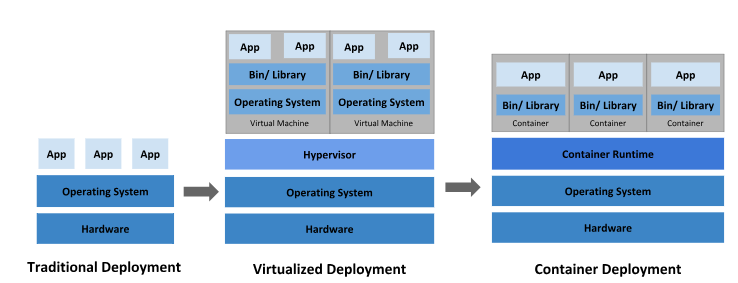
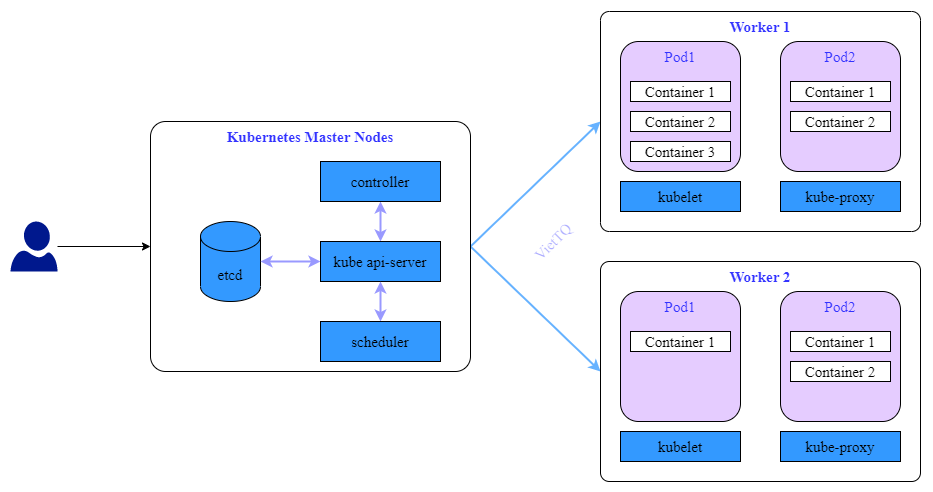
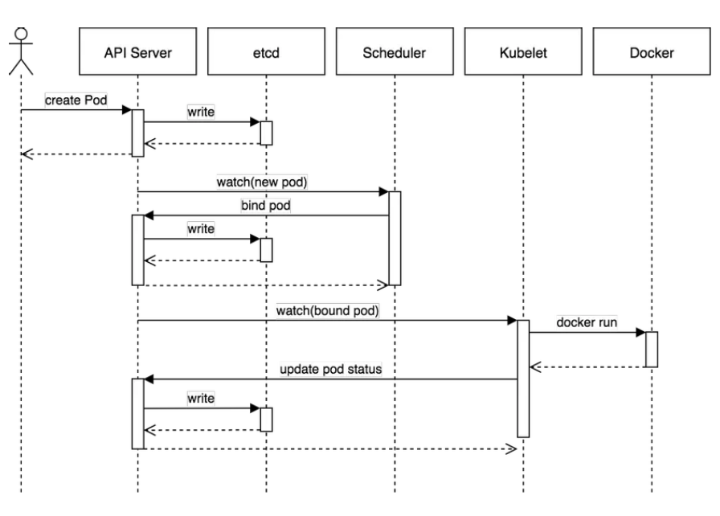
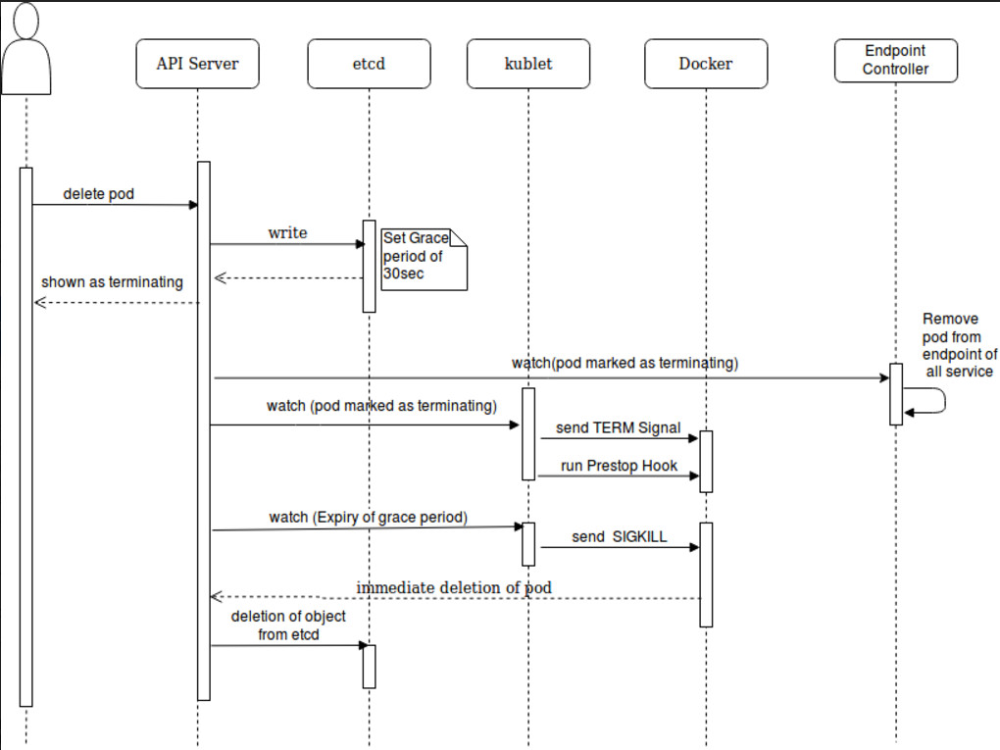

# Kubernetes

## 1. Kubernetes là gì

### 1.1 Giới thiệu về Kubernetes

  

  <i><a href=https://kubernetes.io/vi/docs/concepts/overview/what-is-kubernetes>
         Giới thiệu về Kubernetes
    </a></i>

Kubernetes là một nền tảng nguồn mở, khả chuyển, có thể mở rộng để quản lý các ứng dụng được đóng gói và các service, giúp thuận lợi trong việc cấu hình và tự động hoá việc triển khai ứng dụng. Kubernetes là một hệ sinh thái lớn và phát triển nhanh chóng. Các dịch vụ, sự hỗ trợ và công cụ có sẵn rộng rãi.

Tên gọi Kubernetes có nguồn gốc từ tiếng Hy Lạp, có ý nghĩa là người lái tàu hoặc hoa tiêu. Google mở mã nguồn Kubernetes từ năm 2014. Kubernetes xây dựng dựa trên một thập kỷ rưỡi kinh nghiệm mà Google có được với việc vận hành một khối lượng lớn workload trong thực tế, kết hợp với các ý tưởng và thực tiễn tốt nhất từ cộng đồng.

**Quay ngược thời gian**

Chúng ta hãy xem tại sao Kubernetes rất hữu ích bằng cách quay ngược thời gian.

  

**_Thời đại triển khai theo cách truyền thống:_** Ban đầu, các ứng dụng được chạy trên các máy chủ vật lý. Không có cách nào để xác định ranh giới tài nguyên cho các ứng dụng trong máy chủ vật lý và điều này gây ra sự cố phân bổ tài nguyên. Ví dụ, nếu nhiều ứng dụng cùng chạy trên một máy chủ vật lý, có thể có những trường hợp một ứng dụng sẽ chiếm phần lớn tài nguyên hơn và kết quả là các ứng dụng khác sẽ hoạt động kém đi. Một giải pháp cho điều này sẽ là chạy từng ứng dụng trên một máy chủ vật lý khác nhau. Nhưng giải pháp này không tối ưu vì tài nguyên không được sử dụng đúng mức và rất tốn kém cho các tổ chức để có thể duy trì nhiều máy chủ vật lý như vậy.

**_Thời đại triển khai ảo hóa:_** Như một giải pháp, ảo hóa đã được giới thiệu. Nó cho phép bạn chạy nhiều Máy ảo (VM) trên CPU của một máy chủ vật lý. Ảo hóa cho phép các ứng dụng được cô lập giữa các VM và cung cấp mức độ bảo mật vì thông tin của một ứng dụng không thể được truy cập tự do bởi một ứng dụng khác.

Ảo hóa cho phép sử dụng tốt hơn các tài nguyên trong một máy chủ vật lý và cho phép khả năng mở rộng tốt hơn vì một ứng dụng có thể được thêm hoặc cập nhật dễ dàng, giảm chi phí phần cứng và hơn thế nữa. Với ảo hóa, bạn có thể có một tập hợp các tài nguyên vật lý dưới dạng một cụm các máy ảo sẵn dùng.

Mỗi VM là một máy tính chạy tất cả các thành phần, bao gồm cả hệ điều hành riêng của nó, bên trên phần cứng được ảo hóa.

**_Thời đại triển khai Container:_** Các container tương tự như VM, nhưng chúng có tính cô lập để chia sẻ Hệ điều hành (HĐH) giữa các ứng dụng. Do đó, container được coi là nhẹ (lightweight). Tương tự như VM, một container có hệ thống tệp (filesystem), CPU, bộ nhớ, process space, v.v. Khi chúng được tách rời khỏi cơ sở hạ tầng bên dưới, chúng có thể khả chuyển (portable) trên cloud hoặc các bản phân phối Hệ điều hành.

Các container đã trở nên phổ biến vì chúng có thêm nhiều lợi ích, chẳng hạn như:

- Tạo mới và triển khai ứng dụng Agile: gia tăng tính dễ dàng và hiệu quả của việc tạo các container image so với việc sử dụng VM image.
- Phát triển, tích hợp và triển khai liên tục: cung cấp khả năng build và triển khai container image thường xuyên và đáng tin cậy với việc rollbacks dễ dàng, nhanh chóng.
- Phân biệt giữa Dev và Ops: tạo các images của các application container tại thời điểm build/release thay vì thời gian triển khai, do đó phân tách các ứng dụng khỏi hạ tầng.
- Khả năng quan sát không chỉ hiển thị thông tin và các metric ở mức Hệ điều hành, mà còn cả application health và các tín hiệu khác.
- Tính nhất quán về môi trường trong suốt quá trình phát triển, testing và trong production: Chạy tương tự trên laptop như trên cloud.
- Tính khả chuyển trên cloud và các bản phân phối HĐH: Chạy trên Ubuntu, RHEL, CoreOS, on-premises, Google Kubernetes Engine và bất kì nơi nào khác.
- Quản lý tập trung ứng dụng: Tăng mức độ trừu tượng từ việc chạy một Hệ điều hành trên phần cứng ảo hóa sang chạy một ứng dụng trên một HĐH bằng logical resources.
- Các micro-services phân tán, elastic: ứng dụng được phân tách thành các phần nhỏ hơn, độc lập và thể được triển khai và quản lý một cách linh hoạt - chứ không phải một app nguyên khối (monolithic).
- Cô lập các tài nguyên: dự đoán hiệu năng ứng dụng
- Sử dụng tài nguyên: hiệu quả

### 1.2 Nên sử dụng Kubernetes khi nào?

- Khi cần phải scaling hệ thống nhanh chóng, và đã sử dụng container (Docker).
- Khi số lượng container đủ lớn cho các dịch vụ
- Các dự án xác định cần scale hệ thống về sau

### 1.3 Kubernetes giải quyết vấn đề gì?

Chạy ứng dụng bằng container sẽ giúp ta rất nhiều vấn đề, nhưng ta hãy thử tưởng tượng nếu số container ta lên tới hơn 1000 thì làm cách nào ta biết được một container nào đó sẽ thuộc về ứng dụng nào hoặc nó thuộc project nào? Và nếu ta muốn tăng performance của ứng dụng bằng cách cho nó chạy bằng 2 hoặc 3 container thì làm cách nào ta có thể dẫn request người dùng tới ứng dụng mà có 2 hoặc 3 container đó, ta sẽ chỉa tới container nào? Và nếu server vật lý của chúng ta bị sự cố và không thể chạy nữa thì sao? Kubernetes sẽ giúp chúng ta giải quyết những vấn đề này nhiều nhất có thể.

**_Kubernetes sinh ra để giải quyết các vấn đề sau:_**

- Việc quản lý hàng loạt docker host
- Container Scheduling
- Rolling update
- Scaling/Auto Scaling
- Monitor vòng đời và tình trạng sống chết của container.
- Self-hearing trong trường hợp có lỗi xãy ra. (Có khả năng phát hiện và tự correct lỗi)
- Service discovery
- Load balancing
- Quản lý data, work node, log
- Infrastructure as Code
- Sự liên kết và mở rộng với các hệ thống khác

## 2. Kiến trúc của Kubernetes

  

Hệ thống Kubernetes gồm 2 phần chính gọi là **Control Plane** và **Data Plane** hay còn gọi là **Master Node** và **Worker Node**. Trong đó Master Node sẽ đóng vai trò xử lý các tác vụ quản lý, điều khiển của hệ thống, còn Worker Node sẽ là nơi xử lý các work load của hệ thống. Các pod sẽ được tạo và chạy trên các Worker Node này.

Trên các Master Node sẽ có 4 thành phần chính gồm:

**etcd:** Là một cơ sở dữ liệu dạng key-value có tính khả dụng và đồng nhất cao. Etcd là nơi K8S lưu trữ toàn bộ các thông tin cấu hình của hệ thống

**controller:** Là một tiến trình chạy nền trên các Master Node. Các tiến trình này chạy liên tục để điều tiết trạng thái của hệ thống Kubernetes. Trong K8S, controller là một vòng lặp điều khiển giám sát trạng thái của cluster được chia sẻ qua qua các api và thực hiện các thay đổi cần thiết để chuyển trạng của cluster tới trạng thái mong muốn.

**kube api-server:** Đây là core của K8S Master, nó mở ra các HTTP API cho phép người dùng cuối cũng như các thành phần khác nhau trong chính K8S cluster có thể trao đổi thông tin với nhau. K8S API cho phép người dùng lấy thông tin về trạng thái của các đối tượng trong hệ thống như Pods, Namespaces, Services... Hầu hết các tác vụ sử dụng kube-api thông qua lệnh kubectl nhưng cũng có thể gọi trực tiếp REST API.

**kube-scheduler:** Đây là service mặc định của K8S làm nhiệm vụ phân phối Pod sẽ được chạy trên node nào. Mỗi Container bên trong Pod có thể có những yêu cầu khác nhau, hoặc ngay các Pod cũng có yêu cầu khác nhau. Do đó nhiệm vụ của Scheduler là tìm kiếm các node thỏa mãn các điều kiện trên và lựa chọn node tối ưu nhất để chạy. Tron trường hợp không có node nào thỏa mãn các điều kiện đặt ra thì Pod sẽ ở trạng thái chưa được lên lịch thực hiện cho tới khi Scheduler tìm được node phù hợp.

Trên các Worker Node sẽ có các thành phần chính gồm:

**kubelet:** Nó đóng vai trò như một "Node Agent" của K8s trên các Worker Node. Nhiệm vụ của nó để Worker Node được đăng ký và quản lý bởi cụm K8S cũng như là nhận nhiệm vụ triển khai các Pod (thường thông qua kube api-server) và đảm báo các container đó chạy ổn định. Lưu ý là kubelete không quản lý các container không được tạo bởi Kubernetes
**kube-proxy:** Kube-proxy là một network proxy chạy trên mỗi node trong K8S cluster, thực hiện một phần Kubernetes Service. Kube-proxy duy trình network rules trên các node. Những network rules này cho phép kết nối mạng đến các pods từ trong hoặc ngoài cluster.
**Container runtime:** Đây là thành phần có trách nhiệm cho việc chạy các container. Một số container runtime điển hình mà k8s hỗ trợ gồm có Docker và Containerd.

### 2.1 Vòng đời của Pod (Pod lifecycle)

**Tạo Pod**
Khi tạo một Pod mới, thì cơ bản các sự kiện diễn ra và các thành phần tham gia và các sự kiện đó như sau:

  

Chi tiết luồng tạo Pod:

1. Khi ta thực hiện tạo một Pod mới, thông tường là dùng lệnh kubectl để apply một file yaml là file mô tả chi thiết các thông tin cần thiết cho việc tạo Pod. Khi đó bản chất lệnh kubectl sẽ làm việc với api-server để gọi một api tương ứng cho việc tạo Pod.

2. API server xử lý yêu cầu trên bằng cách validate cú pháp của file yaml và nếu không có vấn đề gì thì sẽ thực hiện ghi dữ liệu này vào etcd - Là key-value db đã mô tả bên trên. Như vậy tại thời điểm này, trên hệ thống đã ghi nhận một Pod mới cần được tạo. Sau khi ghi xong vào etcd thì api-server phản hồi lại kết quả cho client là Pod đã được tạo.

3. Lúc này tới lượt scheduler tham gia vào. Như đã nói, nó sẽ theo dõi các Pod mới tạo trên hệ thống (bằng cách định kỳ kiểm tra api-server xem có thay đổi không) mà chưa được gán vào node để xử lý. Giờ nó phát hiện ra Pod mới này, nó sẽ lấy thông tin của Pod này và tìm một node thỏa mãn các yêu cầu, ví dụ là node1 và update vào thông tin của Pod là nó hãy chạy trên node1. Thông tin này được scheduler gửi cho api-server

4. API server nhận được thông tin Pod mới được gán vào node1 thì thực hiện update thông tin này và etcd. Lúc nào pod ở trạng thái bound.

5. Tiếp đến là kubelet cũng theo dõi các Pod ở trạng thái bound và được xếp lịch chạy trên node đó (bằng cách định kỳ lấy thông tin từ api-server). Ví dụ trong trường hợp này kubelet trên node1 phát hiện Pod mới được yêu cầu chạy trên node1 nên nó sẽ lấy thông tin cần thiết cho Pod và chạy Pod này thành các container trên node1. sau đó update lại trạng thái của Pod cho api-server.

6. API server nhận được thông tin cập nhật trạng thái Pod từ kubelet ở node1 thì nó thực hiện ghi thông tin này vào etcd và nhận phản hồi kết quả từ etcd. Sau đó nó gửi bản tin acknowledgement tới kubelete để báo rằng event này đã được chấp nhận.

**Xóa Pod**
Ngược lại với tạo Pod thì ta xem xét luồng xóa Pod như sau:

  

Chi tiết luồng xóa Pod:

1. Người dùng gửi lệnh để xóa Pod
2. Đối tượng Pod trên k8s được cập nhật trạng thái thành "dead" sau một khoảng thời gian gọi là grace-time
3. Các hành động sau diễn ra song song:

   - Pod sẽ hiện thị ở trạng thái "Terminating" khi được kiểm tra từ phía client
   - Kubelet thấy một Pod được đánh dấu là Terminating thì nó bắt đầu thực hiện dừng process của Pod
   - Endpoint controller theo dõi pod đã được xóa chưa để xóa thông tin pod đó khỏi các endpoint mà nó phục vụ

4. Nếu pod có định nghĩa một preStop hook, thì nó được gọi tới bên trong pod. Nếu preStop hook vẫn đang chạy mà grace-time đã hết, thì bước (2) sẽ lại được gọi với thời gian grace-time nới thêm là 2 giây. Có thể tìm hiểu thêm về ["Container hook" ở đây](https://kubernetes.io/docs/concepts/containers/container-lifecycle-hooks/).

5. Process bên trong Pod đã được gửi tín hiệu yêu cầu terminate (TERM signal)
   Sau khi grace-time kết thúc, thì mọi process bên trong Pod sẽ bị kill bởi SIGKILL.
   Kubelet hoàn thành xóa Pod bằng cách gọi API server và set grace-time bằng 0, nghĩa là yêu cầu xóa ngay lập tức. Lúc này Pod sẽ không còn và client sẽ không thể thấy được Pod này nữa.
