# Extending Kubernetes

[Welcome to this hands on exercise on Extending Kubernetes](https://killercoda.com/aghilish/scenario/extending_k8s)

In this training will

1. Look into Custom Resource Definition API of Kubernetes
2. Install Kubebuilder and Create a New Project
3. Create Our First API
4. A Look into Kubebuilder Setup
5. Add Some Logging to the Reconcile Function
6. Implement the Desired State of the Ghost Operator
7. Access the Custom Resource Inside the Reconcile Function
8. Implement the Ghost Operator Logic, Part 1 - PVC
9. Implement the Ghost Operator Logic, Part 2 - RBAC
10. Implement the Ghost Operator Logic, Part 3 - Deployment
11. Implement the Ghost Operator Logic, Part 4 - Service
12. Implement the Final Logic of the Reconcile Function
13. Update the Ghost Resource
14. Delete the Ghost Resource
15. Deploy Ghost Operator to the Cluster

## 1. A Look into Custom Resource Definition (CRD) API - 1 / 15

let's start by using the `custom resource definition` api of kubernetes. let's create a custom resource called `CronTab`

```
kubectl apply -f - << EOF
apiVersion: apiextensions.k8s.io/v1
kind: CustomResourceDefinition
metadata:
  # name must match the spec fields below, and be in the form: <plural>.<group>
  name: crontabs.stable.example.com
spec:
  # group name to use for REST API: /apis/<group>/<version>
  group: stable.example.com
  # list of versions supported by this CustomResourceDefinition
  versions:
    - name: v1
      # Each version can be enabled/disabled by Served flag.
      served: true
      # One and only one version must be marked as the storage version.
      storage: true
      schema:
        openAPIV3Schema:
          type: object
          properties:
            spec:
              type: object
              properties:
                cronSpec:
                  type: string
                image:
                  type: string
                replicas:
                  type: integer

      additionalPrinterColumns:
        - name: Spec
          type: string
          description: The cron spec defining the interval a CronJob is run
          jsonPath: .spec.cronSpec
        - name: Replicas
          type: integer
          description: The number of jobs launched by the CronJob
          jsonPath: .spec.replicas
        - name: Age
          type: date
          jsonPath: .metadata.creationTimestamp
  # either Namespaced or Cluster
  scope: Namespaced
  names:
    # plural name to be used in the URL: /apis/<group>/<version>/<plural>
    plural: crontabs
    # singular name to be used as an alias on the CLI and for display
    singular: crontab
    # kind is normally the CamelCased singular type. Your resource manifests use this.
    kind: CronTab
    # shortNames allow shorter string to match your resource on the CLI
    shortNames:
    - ct
EOF
```

now our CronTab resource type is created. kubectl get crd

A new namespaced RESTful API endpoint is created at:

`/apis/stable.example.com/v1/namespaces/*/crontabs/...`

<div align="center">
  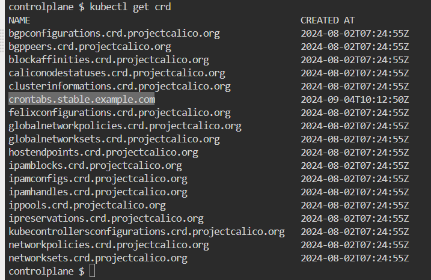
</div>

Now we can create custom objects of our new custom resource defintion. In the following example, the `cronSpec` and `image` custom fields are set in a custom object of kind `CronTab`. The kind CronTab comes from the `spec` of the CustomResourceDefinition object you created above.

```
kubectl apply -f - << EOF
apiVersion: "stable.example.com/v1"
kind: CronTab
metadata:
  name: my-new-cron-object
spec:
  cronSpec: "* * * * */5"
  image: my-awesome-cron-image
EOF
```

Get custom resrouce
`kubectl get crontab`

<div align="center">
  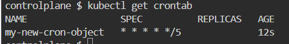
</div>

Delete custom resource
`kubectl delete CronTab my-new-cron-object`

## 2. Install Kubebuilder and Create a New Project - 2 / 15

Now install Kubebuilder into our environment.

```
#download kubebuilder and install locally.
curl -L -o kubebuilder "https://go.kubebuilder.io/dl/latest/$(go env GOOS)/$(go env GOARCH)"
chmod +x kubebuilder && mv kubebuilder /usr/local/bin/
```

Let us make sure we have the latest version of GO installed.

```
curl -OL  https://go.dev/dl/go1.22.3.linux-amd64.tar.gz \
&&  rm -rf /usr/local/go && tar -C /usr/local -xzf go1.22.3.linux-amd64.tar.gz \
&& export PATH=$PATH:/usr/local/go/bin
```

And scaffold a kubebuilder application.
`mkdir ghost-operator`
`cd ghost-operator`
`kubebuilder init --repo example.com --domain example.com`

let us have a closer look at the make file first. make targets are the commands that are used for different development lifecycle steps

`make help`

<div align="center">
  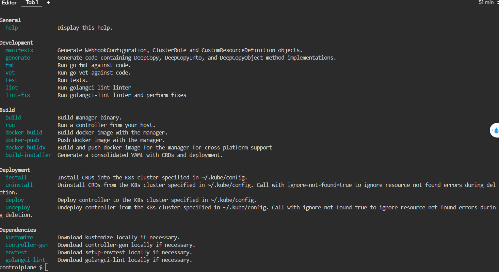
</div>

to run your kubebuilder application locally
`make run`

now have a look at the `run` target and all the prerequisite comamnds that need to run it looks something like this

```
.PHONY: run
run: manifests generate fmt vet ## Run a controller from your host.
	go run ./cmd/main.go
```

> so the targets that need to run before we can run our applications are
>
> 1. `manifests` and `generate` which both have controller-gen as prerequisite and generate some golang code and yaml manifests
> 2. the code is formatted by `fmt`
> 3. validated by `vet`
> 4. `run` will run the go application by refering to the application entrypoint at ./cmd/main.go

## 3. Create Our First API - 3 / 15

Now we have a working yet empty go application. Let's add some meaningful code to it.

Let's imagine we are working at company where our colleagues are heavy users of the ghost blogging application. Our job is to provide them with ghost instances whenever and whereever they want it. We are infra gurus and through years of experience have learned that building an automation for such a task can save us a lot of toil and manual labor.

Our operator will take care of the following:

1. create a new instance of the ghost application as a website in our cluster if our cluster doesn't have it already
2. update our ghost application when our ghost application custom resource is updated.
3. delete the ghost application upon request

Kubebuilder provides a command that allows us to create a custom resource and a process that keeps maintaing (reconciling) that resouce. If we choose to create a new resouces (let's call it Ghost ) kubebuilder will create a blog controller for it automatically.

```
kubebuilder create api \
  --kind Ghost \
  --group blog \
  --version v1 \
  --resource true \
  --controller true
```

At this stage, Kubebuilder has wired up two key components for your operator.

- A Resource in the form of a Custom Resource Definition (CRD) with the kind `Ghost` .
- A Controller that runs each time a `Ghost` CRD is created, changed, or deleted.

The command we ran added a Golang representation of the `Ghost` Custom Resource Definition (CRD) to our operator scaffolding code. To view this code, navigate to your Code editor tab under `api > v1 > ghost_types.go`.

Let us have a look at the `type GhostSpec struct`. This is the code definition of the Kubernetes object spec. This spec contains a field named `foo` which is defined in `api/v1/ghost_types.go:32`. There is even a helpful comment above the field describing the use of foo.

now let us see how kubebuilder can generate a yaml file for our `Custom Resource Definition`

`make manifests`

you will find the generated crd at `config/crd/bases/blog.example.com_ghosts.yaml` see how kubebuilder did all the heavylifting we had to previously do for the crontab example! lovely!

Now let us install the CRD into our cluster and notice the difference by looking at our kubernetes crds.

`kubectl get crds`
now let us install the crd we generated onto the cluster
`make install`
and run the get the crds again
`kubectl get crds`

<div align="center">
  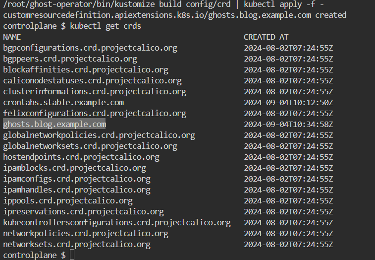
</div>

## 4. A Look into Kubebuilder Setup - 4 / 15

When you selected to create a operator along with the `Ghost` Resource, Kubebuilder took care of some key setup:

1. Starts the operator process during application boot
2. Implements a custom Reconcile function to run on each `Ghost` resource event
3. Configures the operator to know which resource events to listen to

To see the start process, navigate to `cmd/main.go:125`. You will see a section that starts the ghost operator.

```
if err = (&controllers.WebsiteReconciler{
  Client: mgr.GetClient(),
  Scheme: mgr.GetScheme(),
}).SetupWithManager(mgr); err != nil {
  setupLog.Error(err, "unable to create controller", "controller", "Website")
  os.Exit(1)
}
```

This is a call to the function `SetupWithManager(mgr)`. Navigate to `internal/controller/ghost_controller.go:58` to view this function. It is already configured to know about the CRD `api/v1/ghost_types.go` or the generated yaml represenation at `crd/bases/blog.example.com_ghosts`.

The most important function inside the controller is the `Reconcile` function `internal/controller/ghost_controller.go:49`. Reconcile is part of the main kubernetes reconciliation loop which aims to move the current state of the cluster closer to the desired state. It is triggered anytime we change the cluster state related to our custom resource `internal/controller/ghost_controller.go:49`.

## 5. Add Some Logging to the Reconcile Function - 5 / 15

let us add some logs to the reconcile function and run the operator application and change the state of the cluster. let us paste this code into the Reconcile function.

```
log := log.FromContext(ctx)
log.Info("Reconciling Ghost")
log.Info("Reconciliation complete")
return ctrl.Result{}, nil
```

and run the application
`make run`

next we need to modify the generated custom resource yaml file navigate to `config/samples/blog_v1_ghost.yaml` and add a `foo: bar` under spec. The custom resource should look like

```
apiVersion: blog.example.com/v1
kind: Ghost
metadata:
  name: ghost-sample
spec:
  foo: bar
```

don't forget to save the file. Now in other terminal window, let's apply it on the cluster.

`kubectl apply -f config/samples/blog_v1_ghost.yaml`

Tada! checkout the logs showing up!

```
INFO    Reconciling Ghost
INFO    Reconciliation complete
```

now let us try deleting the resource.

`kubectl delete -f config/samples/blog_v1_ghost.yaml`
Same logs showed up again. So basically anytime you interact with your Ghost resource, a new event is triggered and your controller will print the logs.

<div align="center">
  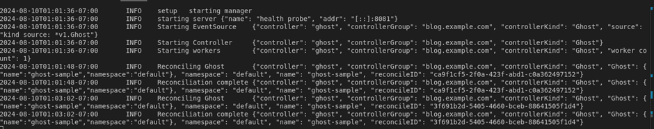
</div>

## 6. Implement the Desired State of the Ghost Operator - 6 / 15

Now let us replace the default GhostSpec with a meaningful declartion of our desired state. Meaning we want our custom resource reflect the desired state for our Ghost application.

replace GhostSpec `api/v1/ghost_types.go:27` with the following snippet

```
type GhostSpec struct {
  //+kubebuilder:validation:Pattern=`^[-a-z0-9]*$`
  ImageTag string `json:"imageTag"`
}
```

This code has two key parts:

- `//+kubebuilder` is a comment prefix that will trigger kubebuilder generation changes. In this case, it will set a validation of the `ImageTag` value to only allow dashes, lowercase letters, or digits.
- The `ImageTag` is the Golang variable used throughout the codebase. Golang uses capitalized public variable names by convention. `json:"imageTag"` defines a "tag" that Kubebuilder uses to generate the YAML field. Yaml parameters starts with lower case variable names by convention. If `omitempty` is used in a json tag, that field will be marked as `optional`, otherwise as `mandatory`.

Before we generete the new crd and install them on the cluster let's do the following, let's have a look at the existing crd

`kubectl get crd ghosts.blog.example.com --output jsonpath="{.spec.versions[0]`
the output should be like

```
{
  "foo": {
    "description": "Foo is an example field of Ghost. Edit ghost_types.go to remove/update",
    "type": "string"
  }
}
```

now, let us install the new crd

`make install`
and see the changes

`kubectl get crd ghosts.blog.example.com --output jsonpath="{.spec.versions[0].schema['openAPIV3Schema'].properties.spec.properties}{\"\n\"}" | jq
`

the output should be

```
{
  "imageTag": {
    "pattern": "^[-a-z0-9]*$",
    "type": "string"
  }
}
```

## 7. Access the Custom Resource Inside the Reconcile Function - 7 / 15

now let us try to access our custom resource in the `reconcile` function. first off, let us reflect our new fields in our cutom resource. let us replace `config/samples/blog_v1_ghost.yaml` with the following

```
apiVersion: blog.example.com/v1
kind: Ghost
metadata:
  name: ghost-sample
  namespace: marketing
spec:
  imageTag: latest
```

```
kubectl create namespace marketing
kubectl apply -f config/samples/blog_v1_ghost.yaml
```

next, let us replace the reconcile code with the following snippet:

```
log := log.FromContext(ctx)
ghost := &blogv1.Ghost{}
if err := r.Get(ctx, req.NamespacedName, ghost); err != nil {
  log.Error(err, "Failed to get Ghost")
  return ctrl.Result{}, client.IgnoreNotFound(err)
}

log.Info("Reconciling Ghost", "imageTag", ghost.Spec.ImageTag, "team", ghost.ObjectMeta.Namespace)
log.Info("Reconciliation complete")
return ctrl.Result{}, nil
```

let us anlyze the above snippet line by line.

- line 1 assings a logger instance to the variable `log` variable.
- line 2 creates an instance of our `Ghost` data structure.
- line 3 tries to read a ghost instance from the reconciler client. Please note that the r which is a reference to the GhostReconciler has a k8s client interface and that interface which implements the Get method which is an equivalent golang implementation of the kubectl get . on succesful Get the resouce will be written to our ghost variable. in case of error, client logs the error. if the error is of type (not found) the controller won't return an error. error not found will happen if we run kubectl delete -f config/samples/blog_v1_ghost.yaml

now we can start our application again:
`make run`

so far our reconcile function is not run yet but if we apply our custom resource in another terminal window:

`kubectl apply -f config/samples/blog_v1_ghost.yaml`

we start to see the logs of our reconcile function

<div align="center">
  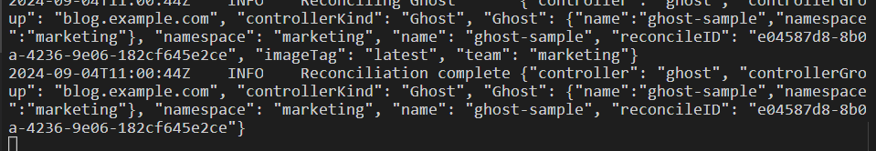
</div>

cool! next stop, we will implement the actual controller logic for our ghost operator.

## 8. Implement the Ghost Operator Logic, Part 1 - PVC - 8 / 15

Before we start coding the ghost operator, we need to know what resources we need in order to deploy ghost to our cluster. let's consult the docker hub page for ghost. https://hub.docker.com/_/ghost

As we would like to persist ghost data to a persistent volume, we can try to convert this docker command to a k8s deployment.

The deployment would look something like

```
apiVersion: apps/v1
kind: Deployment
metadata:
  name: ghost-deployment
spec:
  replicas: 1 # You can adjust the number of replicas as needed
  selector:
    matchLabels:
      app: ghost
  template:
    metadata:
      labels:
        app: ghost
    spec:
      containers:
      - name: ghost
        image: ghost:alpine
        env:
        - name: NODE_ENV
          value: development
        - name: database__connection__filename
          value: /var/lib/ghost/content/data/ghost.db
        ports:
        - containerPort: 2368
        volumeMounts:
        - name: ghost-data
          mountPath: /var/lib/ghost/content
      volumes:
      - name: ghost-data
        persistentVolumeClaim:
          claimName: ghost-data-pvc # Define your PVC or use an existing one
```

As you can see this deployment expects an existing persistent volume claim called `ghost-data-pvc`

We can define it with this yaml:

```
apiVersion: v1
kind: PersistentVolumeClaim
metadata:
  name: ghost-data-pvc
spec:
  accessModes:
    - ReadWriteOnce
  resources:
    requests:
      storage: 1Gi
```

In our operator, each team's ghost instance will be deployed to the team's corresponding namespace. Let us try to code the pvc provisiong into our controller. For that we need to copy the following snippet to our controller. `internal/controller/ghost_controller.go`

```
apiVersion: v1
kind: PersistentVolumeClaim
metadata:
  name: ghost-data-pvc
spec:
  accessModes:
    - ReadWriteOnce
  resources:
    requests:
      storage: 1Gi
In our operator, each team's ghost instance will be deployed to the team's corresponding namespace. Let us try to code the pvc provisiong into our controller. For that we need to copy the following snippet to our controller. internal/controller/ghost_controller.go

func (r *GhostReconciler) addPvcIfNotExists(ctx context.Context, ghost *blogv1.Ghost) error {
	log := log.FromContext(ctx)

	pvc := &corev1.PersistentVolumeClaim{}
	team := ghost.ObjectMeta.Namespace
	pvcName := pvcNamePrefix + team

	err := r.Get(ctx, client.ObjectKey{Namespace: ghost.ObjectMeta.Namespace, Name: pvcName}, pvc)

	if err == nil {
		// PVC exists, we are done here!
		return nil
	}

	// PVC does not exist, create it
	desiredPVC := generateDesiredPVC(ghost, pvcName)
	if err := controllerutil.SetControllerReference(ghost, desiredPVC, r.Scheme); err != nil {
		return err
	}

	if err := r.Create(ctx, desiredPVC); err != nil {
		return err
	}
	r.recoder.Event(ghost, corev1.EventTypeNormal, "PVCReady", "PVC created successfully")
	log.Info("PVC created", "pvc", pvcName)
	return nil
}

func generateDesiredPVC(ghost *blogv1.Ghost, pvcName string) *corev1.PersistentVolumeClaim {
	return &corev1.PersistentVolumeClaim{
		ObjectMeta: metav1.ObjectMeta{
			Name:      pvcName,
			Namespace: ghost.ObjectMeta.Namespace,
		},
		Spec: corev1.PersistentVolumeClaimSpec{
			AccessModes: []corev1.PersistentVolumeAccessMode{corev1.ReadWriteOnce},
			Resources: corev1.VolumeResourceRequirements{
				Requests: corev1.ResourceList{
					corev1.ResourceStorage: resource.MustParse("1Gi"),
				},
			},
		},
	}
}
```

Let's make sure we have the following import statements in the import section of our controller `internal/controller/ghost_controller.go`.

```
corev1 "k8s.io/api/core/v1"
metav1 "k8s.io/apimachinery/pkg/apis/meta/v1"
"k8s.io/apimachinery/pkg/api/resource"
"sigs.k8s.io/controller-runtime/pkg/controller/controllerutil"
"k8s.io/client-go/tools/record"
```

Also let's replace our `GhostReconciler` struct with the following snippet

```
type GhostReconciler struct {
	client.Client
	Scheme  *runtime.Scheme
	recoder record.EventRecorder
}
```

and Let's add

```
const pvcNamePrefix = "ghost-data-pvc-"
const deploymentNamePrefix = "ghost-deployment-"
const svcNamePrefix = "ghost-service-"
```

right after our GhostReconciler struct. And add this line as the first line of the SetupWithManager function.

`r.recoder = mgr.GetEventRecorderFor("ghost-controller")`

The `addPvcIfNotExists` function, checks whether the pvc is already created and if not, it will create it in the right namespace.

let's rebuild the application to make sure there are no syntax errors.
`make`

## 9. Implement the Ghost Operator Logic, Part 2 - RBAC - 9 / 15

Next, we need to specify the kubebuilder markers for RBAC. After we created our apis there are 3 markers generated by default.

```
//+kubebuilder:rbac:groups=blog.example.com,resources=ghosts,verbs=get;list;watch;create;update;patch;delete
//+kubebuilder:rbac:groups=blog.example.com,resources=ghosts/status,verbs=get;update;patch
//+kubebuilder:rbac:groups=blog.example.com,resources=ghosts/finalizers,verbs=update
```

These markers with `//+kubebuilder` prefix are picked up by `make manfists` where a `ClusterRole` manifests is generated and assiged to the operator manager application. When we CRUD other APIs such as deployment, services and Persistent Volume Claims, we need to add those related markers, otherwise our operator will be unauthorized to perform those operations. In case of our operator, we need to additional markers right below the default ones at `internal/controller/ghost_controller.go`.

```
//+kubebuilder:rbac:groups=blog.example.com,resources=ghosts/events,verbs=get;list;watch;create;update;patch
//+kubebuilder:rbac:groups="",resources=persistentvolumeclaims,verbs=get;list;watch;create;update;patch;delete
//+kubebuilder:rbac:groups=apps,resources=deployments,verbs=get;list;watch;create;update;patch;delete
//+kubebuilder:rbac:groups="",resources=services,verbs=get;list;watch;create;update;patch;delete
```

Please note the first one, is needed when we later introduce a function to persist operator events in the ghost resource. To generate RBAC manfiests, we can run

`make manifests`

The generated manifest for the manager cluster role, will be generated at `config/rbac/role.yaml`

## 10. Implement the Ghost Operator Logic, Part 3 - Deployment - 10 / 15

Next, we add the deployment create and update logic to our controller. For that we copy the following snippet to our controller. The logic is very similar to the previous snippet. However there is one key difference and that is that `addOrUpdateDeployment` can also update a deployment in case the deployed `imageTag` for the ghost image is different from the one coming from the `ghost.Spec` aka. desired state.

```
func (r *GhostReconciler) addOrUpdateDeployment(ctx context.Context, ghost *blogv1.Ghost) error {
	log := log.FromContext(ctx)
	deploymentList := &appsv1.DeploymentList{}
	labelSelector := labels.Set{"app": "ghost-" + ghost.ObjectMeta.Namespace}

	err := r.List(ctx, deploymentList, &client.ListOptions{
		Namespace:     ghost.ObjectMeta.Namespace,
		LabelSelector: labelSelector.AsSelector(),
	})
	if err != nil {
		return err
	}

	if len(deploymentList.Items) > 0 {
		// Deployment exists, update it
		existingDeployment := &deploymentList.Items[0] // Assuming only one deployment exists
		desiredDeployment := generateDesiredDeployment(ghost)

		// Compare relevant fields to determine if an update is needed
		if existingDeployment.Spec.Template.Spec.Containers[0].Image != desiredDeployment.Spec.Template.Spec.Containers[0].Image {
			// Fields have changed, update the deployment
			existingDeployment.Spec = desiredDeployment.Spec
			if err := r.Update(ctx, existingDeployment); err != nil {
				return err
			}
			log.Info("Deployment updated", "deployment", existingDeployment.Name)
			r.recoder.Event(ghost, corev1.EventTypeNormal, "DeploymentUpdated", "Deployment updated successfully")
		} else {
			log.Info("Deployment is up to date, no action required", "deployment", existingDeployment.Name)
		}
		return nil
	}

	// Deployment does not exist, create it
	desiredDeployment := generateDesiredDeployment(ghost)
	if err := controllerutil.SetControllerReference(ghost, desiredDeployment, r.Scheme); err != nil {
		return err
	}
	if err := r.Create(ctx, desiredDeployment); err != nil {
		return err
	}
	r.recoder.Event(ghost, corev1.EventTypeNormal, "DeploymentCreated", "Deployment created successfully")
	log.Info("Deployment created", "team", ghost.ObjectMeta.Namespace)
	return nil
}

func generateDesiredDeployment(ghost *blogv1.Ghost) *appsv1.Deployment {
	replicas := int32(1) // Adjust replica count as needed
	return &appsv1.Deployment{
		ObjectMeta: metav1.ObjectMeta{
			GenerateName: deploymentNamePrefix,
			Namespace:    ghost.ObjectMeta.Namespace,
			Labels: map[string]string{
				"app": "ghost-" + ghost.ObjectMeta.Namespace,
			},
		},
		Spec: appsv1.DeploymentSpec{
			Replicas: &replicas,
			Selector: &metav1.LabelSelector{
				MatchLabels: map[string]string{
					"app": "ghost-" + ghost.ObjectMeta.Namespace,
				},
			},
			Template: corev1.PodTemplateSpec{
				ObjectMeta: metav1.ObjectMeta{
					Labels: map[string]string{
						"app": "ghost-" + ghost.ObjectMeta.Namespace,
					},
				},
				Spec: corev1.PodSpec{
					Containers: []corev1.Container{
						{
							Name:  "ghost",
							Image: "ghost:" + ghost.Spec.ImageTag,
							Env: []corev1.EnvVar{
								{
									Name:  "NODE_ENV",
									Value: "development",
								},
								{
									Name:  "database__connection__filename",
									Value: "/var/lib/ghost/content/data/ghost.db",
								},
							},
							Ports: []corev1.ContainerPort{
								{
									ContainerPort: 2368,
								},
							},
							VolumeMounts: []corev1.VolumeMount{
								{
									Name:      "ghost-data",
									MountPath: "/var/lib/ghost/content",
								},
							},
						},
					},
					Volumes: []corev1.Volume{
						{
							Name: "ghost-data",
							VolumeSource: corev1.VolumeSource{
								PersistentVolumeClaim: &corev1.PersistentVolumeClaimVolumeSource{
									ClaimName: "ghost-data-pvc-" + ghost.ObjectMeta.Namespace,
								},
							},
						},
					},
				},
			},
		},
	}
}
```

And let's make sure the following import statements are added to the import section.

```
appsv1 "k8s.io/api/apps/v1"
"k8s.io/apimachinery/pkg/labels"
```

let's rebuild the application to make sure there are no syntax errors.

`male`

## 11. Implement the Ghost Operator Logic, Part 4 - Service - 11 / 15

And Lastly we need to add a service for our deployment. For now let's choose a service of type `NodePort`

```
apiVersion: v1
kind: Service
metadata:
  name: ghost-service
spec:
  type: NodePort
  ports:
    - port: 80 # Exposed port on the service
      targetPort: 2368 # Port your application is listening on inside the pod
      nodePort: 30001 # NodePort to access the service externally
  selector:
    app: ghost
```

Next, we need to implement a go funtion that creates such service for us.

```
func (r *GhostReconciler) addServiceIfNotExists(ctx context.Context, ghost *blogv1.Ghost) error {
	log := log.FromContext(ctx)
	service := &corev1.Service{}
	err := r.Get(ctx, client.ObjectKey{Namespace: ghost.ObjectMeta.Namespace, Name: svcNamePrefix + ghost.ObjectMeta.Namespace}, service)
	if err != nil && client.IgnoreNotFound(err) != nil {
		return err
	}

	if err == nil {
		// Service exists
		return nil
	}
	// Service does not exist, create it
	desiredService := generateDesiredService(ghost)
	if err := controllerutil.SetControllerReference(ghost, desiredService, r.Scheme); err != nil {
		return err
	}

	// Service does not exist, create it
	if err := r.Create(ctx, desiredService); err != nil {
		return err
	}
	r.recoder.Event(ghost, corev1.EventTypeNormal, "ServiceCreated", "Service created successfully")
	log.Info("Service created", "service", desiredService.Name)
	return nil
}

func generateDesiredService(ghost *blogv1.Ghost) *corev1.Service {
	return &corev1.Service{
		ObjectMeta: metav1.ObjectMeta{
			Name:      "ghost-service-" + ghost.ObjectMeta.Namespace,
			Namespace: ghost.ObjectMeta.Namespace,
		},
		Spec: corev1.ServiceSpec{
			Type: corev1.ServiceTypeNodePort,
			Ports: []corev1.ServicePort{
				{
					Port:       80,
					TargetPort: intstr.FromInt(2368),
					NodePort:   30001,
				},
			},
			Selector: map[string]string{
				"app": "ghost-" + ghost.ObjectMeta.Namespace,
			},
		},
	}
}
```

And let's make sure the following import statements are added to the import section.

let's rebuild the application to make sure there are no syntax errors.

`make`

## 12. Implement the Final Logic of the Reconcile Function - 12 / 15

Next we need to use our helper functions and write our reconcile function. We start by calling the functions we added one by one. In case there is an error we update the status of our ghost deployment. For that, we need to make a couple of adjustments first. First we replace `GhostStatus` in `api/v1/ghost_types.go` with the following

```
type GhostStatus struct {
    Conditions []metav1.Condition `json:"conditions,omitempty"`
}
```

and we add two helper functions to our controller. `internal/controller/ghost_controller.go`

```
// Function to add a condition to the GhostStatus
func addCondition(status *blogv1.GhostStatus, condType string, statusType metav1.ConditionStatus, reason, message string) {
	for i, existingCondition := range status.Conditions {
		if existingCondition.Type == condType {
			// Condition already exists, update it
			status.Conditions[i].Status = statusType
			status.Conditions[i].Reason = reason
			status.Conditions[i].Message = message
			status.Conditions[i].LastTransitionTime = metav1.Now()
			return
		}
	}

	// Condition does not exist, add it
	condition := metav1.Condition{
		Type:               condType,
		Status:             statusType,
		Reason:             reason,
		Message:            message,
		LastTransitionTime: metav1.Now(),
	}
	status.Conditions = append(status.Conditions, condition)
}

// Function to update the status of the Ghost object
func (r *GhostReconciler) updateStatus(ctx context.Context, ghost *blogv1.Ghost) error {
	// Update the status of the Ghost object
	if err := r.Status().Update(ctx, ghost); err != nil {
		return err
	}

	return nil
}
```

And finally our reconcile function should be replaced with the following snippet.

```
func (r *GhostReconciler) Reconcile(ctx context.Context, req ctrl.Request) (ctrl.Result, error) {
	log := log.FromContext(ctx)
	ghost := &blogv1.Ghost{}
	if err := r.Get(ctx, req.NamespacedName, ghost); err != nil {
		log.Error(err, "Failed to get Ghost")
		return ctrl.Result{}, client.IgnoreNotFound(err)
	}
	// Initialize completion status flags
	// Add or update the namespace first
	pvcReady := false
	deploymentReady := false
	serviceReady := false
	log.Info("Reconciling Ghost", "imageTag", ghost.Spec.ImageTag, "team", ghost.ObjectMeta.Namespace)
	// Add or update PVC
	if err := r.addPvcIfNotExists(ctx, ghost); err != nil {
		log.Error(err, "Failed to add PVC for Ghost")
		addCondition(&ghost.Status, "PVCNotReady", metav1.ConditionFalse, "PVCNotReady", "Failed to add PVC for Ghost")
		return ctrl.Result{}, err
	} else {
		pvcReady = true
	}
	// Add or update Deployment
	if err := r.addOrUpdateDeployment(ctx, ghost); err != nil {
		log.Error(err, "Failed to add or update Deployment for Ghost")
		addCondition(&ghost.Status, "DeploymentNotReady", metav1.ConditionFalse, "DeploymentNotReady", "Failed to add or update Deployment for Ghost")
		return ctrl.Result{}, err
	} else {
		deploymentReady = true
	}
	// Add or update Service
	if err := r.addServiceIfNotExists(ctx, ghost); err != nil {
		log.Error(err, "Failed to add Service for Ghost")
		addCondition(&ghost.Status, "ServiceNotReady", metav1.ConditionFalse, "ServiceNotReady", "Failed to add Service for Ghost")
		return ctrl.Result{}, err
	} else {
		serviceReady = true
	}
	// Check if all subresources are ready
	if pvcReady && deploymentReady && serviceReady {
		// Add your desired condition when all subresources are ready
		addCondition(&ghost.Status, "GhostReady", metav1.ConditionTrue, "AllSubresourcesReady", "All subresources are ready")
	}
	log.Info("Reconciliation complete")
	if err := r.updateStatus(ctx, ghost); err != nil {
		log.Error(err, "Failed to update Ghost status")
		return ctrl.Result{}, err
	}

	return ctrl.Result{}, nil
}
```

now, let us run our operator application. Before we do that, let's make sure we are starting from scratch.

`kubectl delete namespace marketing`
`make run`

we can see the logs and see that our operator application is up and running, in another termainl we create a ghost resource.

`kubectl create namespace marketing`
`kubectl apply -f config/samples/blog_v1_ghost.yaml`
We start to see our reconciliation logs showing up and our subresources being created. We can inspect them by running

`kubectl get pvc,deploy,svc -n marketing`

<div align="center">
  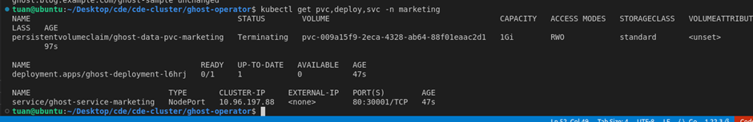
</div>

Let us have a look at our ghost resource as well.

`kubectl describe -n marketing ghosts.blog.example.com gh`

<div align="center">
  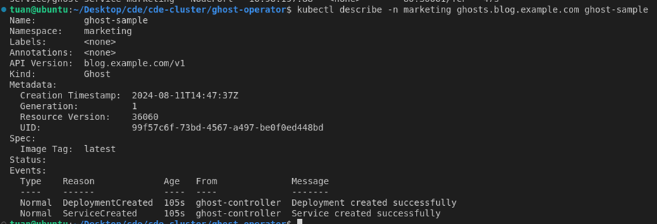
</div>

## 13. Update the Ghost Resource - 13 / 15

let us perform an update on our resource and use the `alpine` image tag instead of `latest` . So, let us replace `config/samples/blog_v1_ghost.yaml` with the following and apply it.

```
apiVersion: blog.example.com/v1
kind: Ghost
metadata:
  name: ghost-sample
  namespace: marketing
spec:
  imageTag: alpine
```

Before applying the new update, please make sure the operator is running.

`make run`
`kubectl apply -f config/samples/blog_v1_ghost.yaml`

We can see that our deployment subresource is being updated and the update logs are showing up in the console. We can confirm this by inspecting the deployment.
`kubectl get deploy -n marketing -ojson | jq -r '.items[].spec.template.spec.containers[0].image'`

<div align="center">
  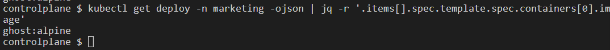
</div>

## 14. Delete the Ghost Resource - 14 / 15

If perform a delete operation on our resource, all the subresouces will be deleted too, as we set their owner to be the ghost resource. Please notice the `controllerutil.SetControllerReference` usage, before creating the subresources.

Let us perform the delete and see the effect.

`kubectl delete ghosts.blog.example.com -n marketing ghost-sample`

We can see all the subresources are deleted.
`kubectl get all -n marketing`

<div align="center">
  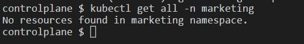
</div>

## 15. Deploy Ghost Operator to the Cluster - 15 / 15

Deploying the Operator to Kubernetes
Your operator is an application, so it needs to be packaged as a OCI compliant container image just like any other container you want to deploy.

We need to run the right make command to build our OCI image and then Deploy it.

Build
`export IMG=tuanquang1811/ghost-operator:v1.0.0`
`make docker-build`

Push
`make docker-push`

<div align="center">
  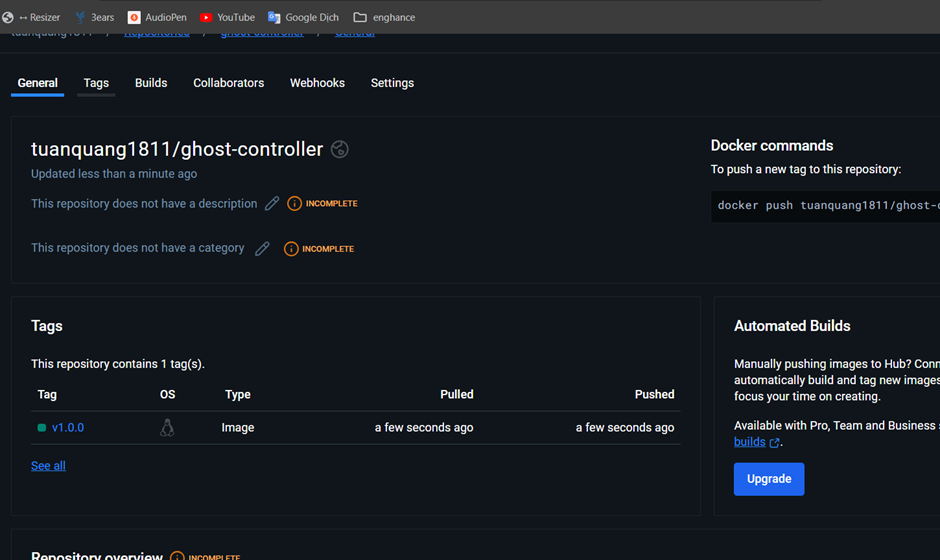
</div>

Deploy
`make deploy`

<div align="center">
  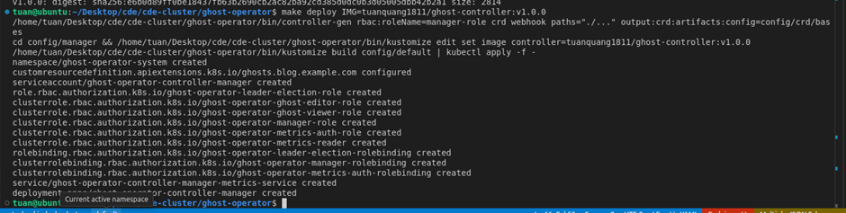
</div>

Undeploy
`make undeploy`

And we can look around and inspect the logs of our manager when we CRUD operations with our ghost API.

`kubectl get all -n ghost-operator-system`

<div align="center">
  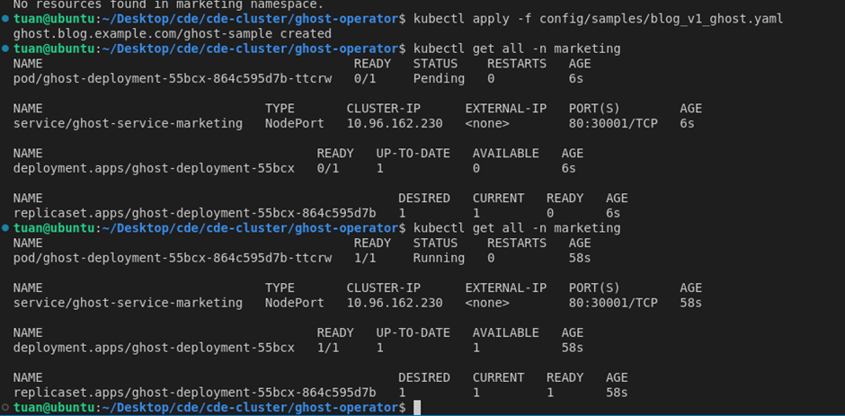
</div>

The k8s cluster is being installed using Kind, currently the service is being exposed using port 30001. We need to map this port from the outside to the Kind container running the cluster.

<div align="center">
  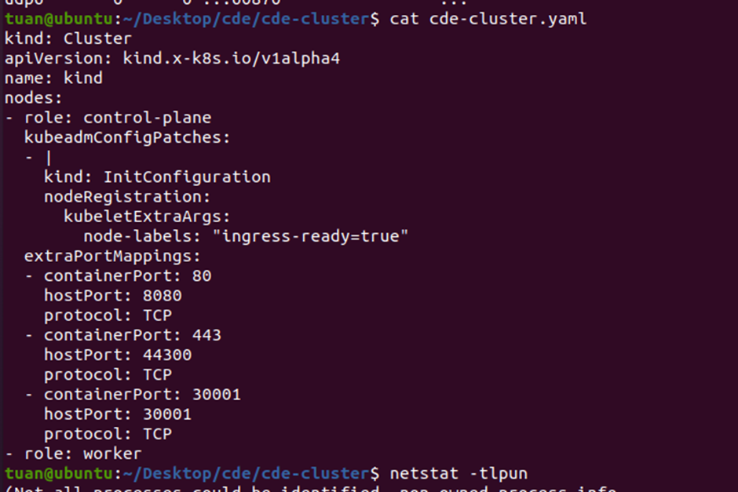
</div>
<div align="center">
  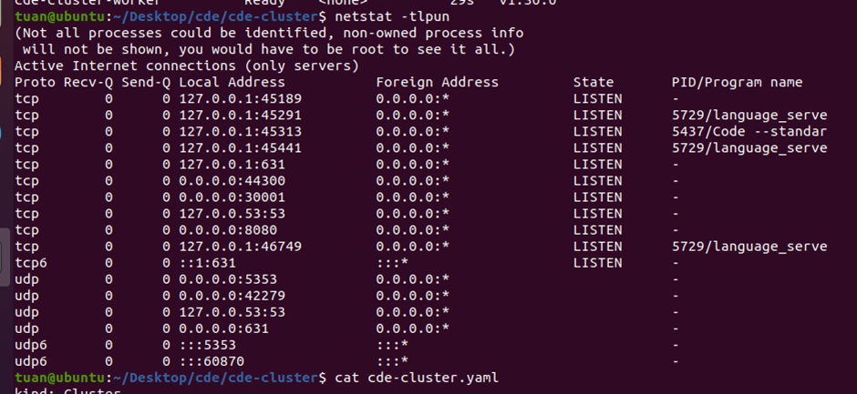
</div>

Access localhost with port 30001

<div align="center">
  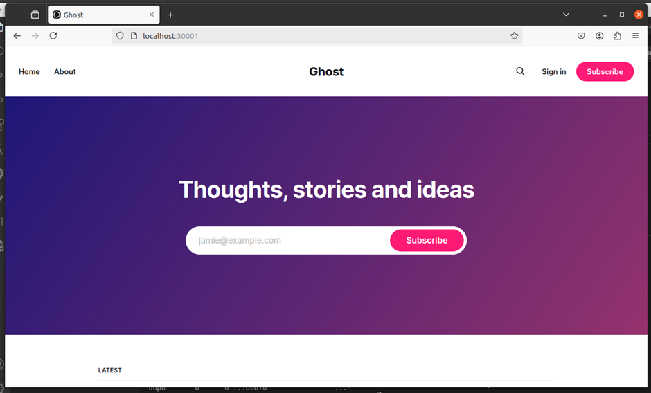
</div>
